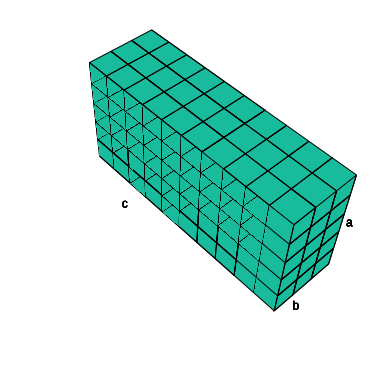
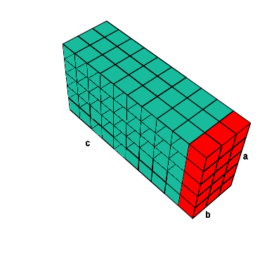
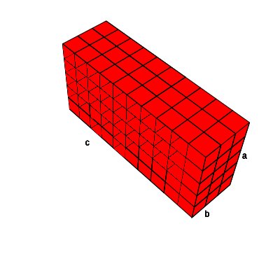
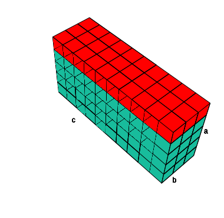

```{r setup, include=FALSE}
require(knitr)
require(kableExtra)
require(ggplot2)
require(reshape2)
library(tidyverse)
library(cowplot)
library(shadowtext)
library(matlib)
library(rlist)
library(latex2exp)
library(rgl)

#Knitr table options
options(knitr.table.format = "html") 

#Chunk options
opts_chunk$set(echo = FALSE)
opts_chunk$set(results = 'asis')
opts_chunk$set(fig.width  = 3)
opts_chunk$set(fig.height = 3)
opts_chunk$set(warning  = FALSE)
opts_chunk$set(message  = FALSE)
opts_chunk$set(fig.align='center')

#Knitr for rgl (3d)
#knit_hooks$set(webgl = hook_webgl)

#Function for authomatic theorem, corollary, example, counterexample, property, lemma and definition numbering
source("Rfun/theorem_creator.R")

plot.rect <- function (max.x = 10, max.y = 5,
                       xlab = as.character(max.x), 
                       ylab = as.character(max.y),
                       label = "Área = base * altura"){
  
  x <- 1:max.x
  y <- 1:max.y
  rect <- data.frame(expand.grid(x,y))
  colnames(rect) <- c("x","y")
  
  ggplot(rect, aes(x = x, y = y)) + 
    geom_tile(color = "white", size = 0.25, 
              fill = "#18bc9c") + 
    xlab(xlab) + ylab(ylab) +
    theme_void() +
    theme(axis.title = element_text()) +
    geom_shadowtext(aes(label=label, x = (max.x+1)/2, y = (max.y+1)/2), 
                    color = "white", bg.colour='black', size=5) 
}

```

Las notas de álgebra están arregladas como un espiral. De inicio, en estas notas, empezaremos dando resutados algebraicos a partir de análisis de figuras. El principal propósito es desarrollar una intuición geométrica de qué representan los términos algebraicos. En la siguiente sección se retomarán varios de los temas y resultados desde otro enfoque más financiero. Finalmente se axiomatizará todo y se hablará del álgebra moderna en una última sección. Esto para entender por qué el álgebra funciona de esa manera. 

# Álgebra desde Geometría 

Una de las preocupaciones principales de la gente que inició los cálculos algebraicos era la estimación de distancias, áreas, volúmenes para construcciones, terrenos, maquinaria, etc. Yo sospecho que en general construir terrenos o diseñar máquinas no va a ser tu objetivo; sin embargo, utilizaremos abstracciones de los problemas que se planteaban para entender un poco la intuición detrás de algunos resultados. 

## Nota sobre las imágenes
A lo largo de estas notas todos los cuadritos medirán $1$. No importa que sean más grandes o más pequeños (eso es porque no sé estandarizar el tamaño de mis gráficas). Entonces una tripa como esta:

```{r, fig.height=1, fig.width=4}
plot.rect(5,1, label = "")
```

mide $5$ cuadritos de largo y $1$ de alto. De manera resumida diré que mide $5$ de largo y $1$ de alto (sin especificar que son "cuadritos"). Lo mismo diré que esta:

```{r, fig.height=0.5, fig.width=6}
plot.rect(16,1, label = "")
```

mide $16$ de largo. Los cuadritos pueden verse _más pequeños_ pero, repito, eso es por mi incapacidad de hacer cuadritos del mismo tamaño. En nuestra imaginación los cuadritos deben ser del mismo tamaño y esta tripa debe medir $16$ de largo. 


Interpretaremos las figuras como sigue: figuras de alto $1$ (cuadrito) interpretaremos la cantidad de cuadritos como números. Un número positivo lo interpretamos como pasos dados a partir del cero (línea negra). Por ejemplo el $9$:

```{r, fig.width=9, fig.height=1}
ggplot() + 
      geom_tile(aes(x = x, y = 1), color = "white", 
                size = 0.25, 
                fill = "#18bc9c", 
                data = data.frame(x = 1:9)) + 
      theme_void() + xlab(as.character(9)) +
      theme(axis.title = element_text()) + ylab("") +
      geom_vline(aes(xintercept = 0.5), size = 2, color = "black")
```

Números negativos los represento a la izquierda del cero como pasos que di en sentido contrario:

```{r, fig.width=9, fig.height=1}
ggplot() + 
      geom_tile(aes(x = x, y = 1), color = "white", 
                size = 0.25, 
                fill = "#e74c3c", 
                data = data.frame(x = -4:0)) + 
      theme_void() + xlab(as.character(-5)) +
      theme(axis.title = element_text()) + ylab("") +
      geom_vline(aes(xintercept = 0.5), size = 1, color = "black")
```

Podemos, por ejemplo, escribir la suma de $5 + 3 = 8$ en términos de cuadritos como sigue:
```{r, fig.width=9, fig.height=0.6}

plot.1suma <- function (a = 5, b = 3, operation = "+",
                        alab = a, blab = b, sumlab = NULL){
  
  result <- eval(parse(text = paste0(a,operation,b)))
  
  if (is.null(sumlab)){
    sumlab <- as.character(result)
  }
  
   if (a > 0){acolor <- "#2c3e50"; astart <- 1; aend <- 0} else {acolor <- "#f39c12"; astart <- 0; aend <- 1}
   if (b > 0){bcolor <- "#18bc9c"; bstart <- 1; bend <- 0} else {bcolor <- "#e74c3c"; bstart <- 0; bend <- 1}

  
  
  plot1 <- ggplot(data.frame(a = astart:(a + aend)),
                  aes(x = a, y = 1)) + 
    geom_tile(color = "white", size = 0.25, 
              fill = acolor) + 
    theme_void() + xlab(as.character(alab)) +
    theme(axis.title = element_text()) + ylab("") +
    geom_vline(aes(xintercept = 0.5), size = 1, color = "black")
  
    plot2 <- ggplot(data.frame(b = bstart:(b + bend)),
                  aes(x = b, y = 1)) + 
    geom_tile(color = "white", size = 0.25, 
              fill = bcolor) + 
    theme_void() + xlab(as.character(blab)) +
    theme(axis.title = element_text()) + ylab("") +
      geom_vline(aes(xintercept = 0.5), size = 1, color = "black")
    
    plot.sign <- ggplot() +
      annotate("text", label = operation, size = 10,
               x = 0, y = 0) + theme_void()
    
    plot.equal <- ggplot() +
      annotate("text", label = "=", size = 10,
               x = 0, y = 0) + theme_void()
      
   
    
    if (operation == "+" & a > 0 & b > 0){  
      plot.result <-   ggplot() + 
        geom_tile(aes(x = x, y = 1), color = "white", 
                  size = 0.25, 
                  fill = acolor, 
                  data = data.frame(x = (a+1):(a+b))) + 
        geom_tile(aes(x = x, y = 1), color = "white", 
            size = 0.25, 
            fill = bcolor, 
            data = data.frame(x = 1:a)) +   
        theme_void() + xlab(as.character(sumlab)) +
        theme(axis.title = element_text()) + ylab("") +
        geom_vline(aes(xintercept = 0.5), size = 1, color = "black")
    } else if (operation == "+" & b < 0) {
      plot.result <-   ggplot() + 
        geom_tile(aes(x = x, y = 1), color = "white", 
                  size = 0.25, 
                  fill = acolor, 
                  data = data.frame(x = 1:(a+b))) + 
        theme_void() + xlab(as.character(sumlab)) +
        theme(axis.title = element_text()) + ylab("") +
        geom_vline(aes(xintercept = 0.5), size = 1, color = "black") 
    } else if (operation == "-" & result <= 0){
      plot.result <-   ggplot() + 
         geom_tile(aes(x = x, y = 1), color = "white", 
                  size = 0.25, 
                  fill = "#e74c3c", 
                  data = data.frame(x = 0:(a-b + 1))) + 
        theme_void() + xlab(as.character(sumlab)) +
        theme(axis.title = element_text()) +
        geom_vline(aes(xintercept = 0.5), size = 1, color = "black") + ylab("")
    } else if (operation == "-" & result > 0){
      plot.result <-   ggplot() + 
         geom_tile(aes(x = x, y = 1), color = "white", 
                  size = 0.25, 
                  fill = "#18bc9c", 
                  data = data.frame(x = (a-b):1)) + 
        theme_void() + xlab(as.character(sumlab)) +
        theme(axis.title = element_text()) +
        geom_vline(aes(xintercept = 0.5), size = 1, color = "black") + ylab("")
    }
    if (result == 0){
      rwidth <- 1; 
      plot.result <- ggplot() + xlab("0") +
        theme_void() +
        theme(axis.title = element_text()) +
         ylab("")
    } else {rwidth <- abs(result)}
    plot_grid(plot1, plot.sign, plot2, plot.equal, plot.result, ncol = 5, 
              rel_widths = c(abs(a),1,abs(b),1,rwidth))
}
plot.1suma()
```

Mientras que la resta $5-3$ reduce la cantidad de cuadrados pues se interpreta como caminar primero $5$ a la derecha y luego $3$ en sentido contrario:
```{r, fig.width=6, fig.height=0.6}
plot.1suma(a = 5, b = 2, "-")
```

Una forma distinta pero equivalente de ver esta resta es como $5 + (-2) = 3$:
```{r, fig.width=6, fig.height=0.6}
plot.1suma(a = 5, b = -2, "+")
```

En particular si el que está restando rebasa al sumando nos regresamos incluso antes que el $0$ como en el caso de $3 - 6 = -3$:

```{r, fig.width=6, fig.height=0.6}
plot.1suma(a = 3, b = 6, operation = "-")
```

Finalmente, notamos que un doble negativo es un positivo (_e.g._ $- (-2) = 2$) esto porque se interpreta el primer menos como _caminar en sentido contrario_ de _caminar en sentido contrario_ (el segundo menos). Por lo que acabamos en sentido correcto. Gráficamente se ve así:

```{r, fig.width=2, fig.height=1, fig.cap="Primero tengo el 2"}
ggplot() + 
      geom_tile(aes(x = x, y = 1), color = "white", 
                size = 0.25, 
                fill = "#18bc9c", 
                data = data.frame(x = 1:2)) + 
      theme_void() + xlab(as.character(2)) +
      theme(axis.title = element_text()) + ylab("") +
      geom_vline(aes(xintercept = 0.5), size = 2, color = "black")
```

```{r, fig.width=2, fig.height=1, fig.cap="En sentido contrario al 2 es el -2"}
ggplot() + 
      geom_tile(aes(x = x, y = 1), color = "white", 
                size = 0.25, 
                fill = "#e74c3c", 
                data = data.frame(x = -1:0)) + 
      theme_void() + xlab(as.character(-2)) +
      theme(axis.title = element_text()) + ylab("") +
      geom_vline(aes(xintercept = 0.5), size = 2, color = "black")
```


```{r, fig.width=2, fig.height=1, fig.cap="En sentido contrario al -2 es el -(-2):"}
ggplot() + 
      geom_tile(aes(x = x, y = 1), color = "white", 
                size = 0.25, 
                fill = "#e74c3c", 
                data = data.frame(x = 1:2)) + 
      theme_void() + xlab("-(-2)") +
      theme(axis.title = element_text()) + ylab("") +
      geom_vline(aes(xintercept = 0.5), size = 2, color = "black")
```
Lo cual me devuelve al $2$ original. Podemos aplicar este conocimiento para el caso de $4 - (-2) = 6$:

```{r, fig.width=6, fig.height=0.6}
plot.1suma(a = 4, b = -2, operation = "-")
```

La multiplicación la analizaremos como un área. Si pensamos que tenemos cuadritos pequeños de tamaño 1, podemos fácilmente ver que el área (en términos de cuántos cuadritos de tamaño 1 hay). Por ejemplo en el siguiente rectángulo tenemos $10 \times 5 = 50$ rectángulos pequeños. 

```{r, fig.width=6}
plot.rect(label = "Área = 10 * 5")
```

La lógica detrás del $10 \times 5$ es que los $10$ elementos de la base se repiten tanto como renglones (altura) haya. De manera general podríamos decir que en cualquier rectángulo la forma de estimar área sería: 
$$
\text{Área Rectángulo} = \text{base}\times\text{altura}
$$
En la parte geométrica esto se vería así:
```{r, fig.width=6}
plot.rect(24, 12, xlab = "base", ylab = "altura") 
```

Por supuesto que los matemáticos somos flojos y por economía del lenguaje preferimos escribir **base** como $b$ y **altura** como $a$. La multiplicación también nos da flojera ponerla y la escribimos como $ab$ donde $ab = a \times b = \text{altura} \times \text{base}$. Gráficamente:

```{r, fig.width=6}
plot.rect(24, 12, xlab = "b", ylab = "a", label = "Área = ab")
```

En el caso específico en que tenemos un cuadrado la altura y la base miden exactamente lo mismo. Podemos ver su área de cualquiera de las siguientes formas:

```{r, fig.width=9}
plot_grid(
plot.rect(6, 6, xlab = "b", ylab = "b", label = "Área = b²"),
ggplot() + theme_void(),
plot.rect(6, 6, xlab = "a", ylab = "a", label = "Área = a²"), ncol = 3)
```

En cualquiera de los casos como base y altura coinciden entonces:
$$
\textrm{Área} = ab = aa = a^2 \quad \text{pues } a = b
$$
o bien:
$$
\textrm{Área} = ab = bb = b^2 \quad \text{pues } b = a.
$$
La interpretación principal, entonces, de elevar al cuadrado va a ser para nuestros propósitos geométricos que, literalmente, se está calculando el área de un cuadrado. 

Por supuesto que no hay ninguna razón para llamarles $a$ y $b$ a los lados de un rectángulo; alguien más podría llamarles $x$ y $y$:
```{r, fig.width=6}
plot.rect(24, 12, xlab = "x", ylab = "y", label = "Área = xy")
```

O bien $L$ (por lado)
```{r}
plot.rect(6, 6, xlab = "L", ylab = "L", label = "Área = L²")
```


> **Ejercicio** Gráficamente muestra que la fórmula del área de un triángulo rectángulo (con un lado con ángulo de 90°) es $ab/2$ donde $a$ es la altura y $b$ la base. _Hint_ Es como un rompecabezas: pega dos triángulos rectángulos y usa la fórmula del rectángulo.  

```{r, fig.cap="Un triángulo rectángulo siendo feliz"}
triangle <- function(x = c(0,0,1), y = c(0,1,0), fill = "#18bc9c",
                     xlab = "", ylab = "", hiplab = ""){
  ggplot() + 
  geom_polygon(aes(x = x, y = y), fill = fill) +
  theme_void() + xlab(xlab) + ylab(ylab) + theme(axis.title = element_text()) +
  annotate("text",label = hiplab, x = 1.1*(x[3] - x[2])/2, 
           y =  1.1*(y[2] - y[3])/2, angle = -45)
}
triangle(xlab = "b", ylab = "a", hiplab = "c")

square <- function(x = c(0,0,1,1), y = c(0,1,1,0), fill = "#18bc9c"){
  ggplot() + 
  geom_polygon(aes(x = x, y = y), fill = fill) +
  theme_void()
}
```


El producto de tres números $a\cdot b \cdot c$ se interpreta de manera similar como el volumen de un prisma cuadrangular:

```{r,results='hide'}
n <- 5
m <- 10
p <- 3

open3d(zoom = 1, 
       userMatrix = structure(c(0.6789630651474, -0.567207217216492, 0.466138660907745, 0, -0.733713150024414, -0.501765966415405, 0.458144247531891, 0, -0.025970246642828, -0.653075039386749, -0.756847679615021, 0, 0, 0, 0, 1), .Dim = c(4L, 4L)), 
       windowRect=c(20, 30, 400, 400))
for (i in 1:n){
    mygrid <- expand.grid(1:m,1:p)
    for (j in 1:nrow(mygrid)){
      c3d <- translate3d(scale3d(cube3d(color="#18bc9c", alpha= 1, lit = FALSE, lwd = 1),0.5,0.5,0.5), x = mygrid[j,1], y = mygrid[j,2], z = i-1)
      shade3d(c3d)   # render the object 
      c3d$material$color <- "black"
      wire3d(c3d)   # render the object 
    }
    c3d <- text3d(m + 1,1,1,"a")
    c3d <- text3d((m + 1)/2,n + 1,1,"c")
    c3d <- text3d(m + 1,(n+1)/2,p + 1,"b")
}
rgl.postscript("images/sumsquares1.svg","svg") 
snapshot3d("images/sumsquares1.png")
```

<!--html preserve-->
<p align="center"></p>
<!--/html preserve-->

La idea detrás de la fórmula es comenzar con una fila, digamos las $a$ para cubrir una cara rectangular de tamaño $ab$:

```{r,results='hide'}
n <- 5
m <- 10
p <- 3

open3d(zoom = 1, 
       userMatrix = structure(c(0.6789630651474, -0.567207217216492, 0.466138660907745, 0, -0.733713150024414, -0.501765966415405, 0.458144247531891, 0, -0.025970246642828, -0.653075039386749, -0.756847679615021, 0, 0, 0, 0, 1), .Dim = c(4L, 4L)), 
       windowRect=c(20, 30, 400, 400))
for (i in 1:n){
    mygrid <- expand.grid(1:m,1:p)
    color  <- "#18bc9c"
    for (j in 1:nrow(mygrid)){
       if (mygrid[j,1] == m){color <- "red"} else {color  <- "#18bc9c"}
      c3d <- translate3d(scale3d(cube3d(color=color, alpha= 1, lit = FALSE, lwd = 1),0.5,0.5,0.5), x = mygrid[j,1], y = mygrid[j,2], z = i-1)
      shade3d(c3d)   # render the object 
      c3d$material$color <- "black"
      wire3d(c3d)   # render the object 
    }
    c3d <- text3d(m + 1,1,1,"a")
    c3d <- text3d((m + 1)/2,n + 1,1,"c")
    c3d <- text3d(m + 1,(n+1)/2,p + 1,"b")
}
rgl.postscript("images/sumsquares2.svg","svg") 
snapshot3d("images/sumsquares2.png")
```

<!--html preserve-->
<p align="center"></p>
<!--/html preserve-->

Una vez que se tiene la cara rectangular de tamaño $ab$ se repite tantas veces como $c$ (la profundidad):

```{r,results='hide'}
n <- 5
m <- 10
p <- 3

open3d(zoom = 1, 
       userMatrix = structure(c(0.6789630651474, -0.567207217216492, 0.466138660907745, 0, -0.733713150024414, -0.501765966415405, 0.458144247531891, 0, -0.025970246642828, -0.653075039386749, -0.756847679615021, 0, 0, 0, 0, 1), .Dim = c(4L, 4L)), 
       windowRect=c(20, 30, 400, 400))
for (i in 1:n){
    mygrid <- expand.grid(1:m,1:p)
    color  <- "red"
    for (j in 1:nrow(mygrid)){
      c3d <- translate3d(scale3d(cube3d(color=color, alpha= 1, lit = FALSE, lwd = 1),0.5,0.5,0.5), x = mygrid[j,1], y = mygrid[j,2], z = i-1)
      shade3d(c3d)   # render the object 
      c3d$material$color <- "black"
      wire3d(c3d)   # render the object 
    }
    c3d <- text3d(m + 1,1,1,"a")
    c3d <- text3d((m + 1)/2,n + 1,1,"c")
    c3d <- text3d(m + 1,(n+1)/2,p + 1,"b")
}
rgl.postscript("images/sumsquares3.svg","svg") 
snapshot3d("images/sumsquares3.png")
```

<!--html preserve-->
<p align="center"></p>
<!--/html preserve-->

de ahí que $abc$ forme sea interpretado como un volumen. 

## Axiomas de la suma/resta

Armados con la interpretación de las figuras anteriores podemos dar los axiomas de la suma. Mi sugerencia es que los escribas en una tarjeta y los tengas a la mano como referencia durante todos los episodios de la parte de álgebra. 

### Asociatividad
En una suma de tres términos es lo mismo sumar el primero más el segundo más el tecero que primero sumar el segundo con el tercero y a eso el primero. Por ejemplo:
$$
5 + (6 + 2) = 5 + 8 = 13 \quad \text{ es lo mismo que} \quad (5 + 6) + 2 = 11 + 2 = 13
$$
O bien:
$$
3 + (4 - 1) = 3 + 3 = 6 \quad \text{ es lo mismo que} \quad (3 + 4) - 1 = 7- 1 = 6
$$
Hay que tener mucho cuidado con los signos para no meter la pata. Por ejemplo:
$$
2 - 1 + 5 = 2 + (-1 + 5) = 2 + 4 = 6 \quad \text{ es lo mismo que} \quad (2 - 1) + 5 = 1 + 5 = 6
$$
pero no es lo mismo que:
$$
2 - 1 + 5 \neq 2 -(1 + 5) = 2 - 6 = -4
$$
Esto porque los números negativos siempre van con su signo. Cuando escribimos:
$2 - 3 = -1$ realmente lo que estamos escribiendo es:
$$
2 + (-3) = 2 -3 = -1
$$
Donde el $+$ del $+ (-3)$ está implícito. Esto es algo que hay que tener siempre en cuenta: sumar un número negativo es equivalente a restar. Las reglas de la suma van a aplicar para la resta sólo si consideramos la resta como sumar el negativo; es decir verlo como en el lado derecho de la igualdad $7 - 3 = 7 + (-3)$. Podemos entonces escribir la propiedad asociativa como sigue: para tres números reales $a,b,c$ se tiene que:
$$
a  + (b + c ) = (a+ b) + c
$$
Con diagrama se ve como sigue:

```{r, fig.width= 10, fig.height=4}
a <- 10
b <- 3
c <- 5

  plota <- ggplot(data.frame(a = 1:a),
                  aes(x = a, y = 1)) + 
    geom_tile(color = "white", size = 0.25, 
              fill = "#18bc9c") + 
    theme_void() + xlab("a") +
    theme(axis.title = element_text()) + ylab("") +
    geom_vline(aes(xintercept = 0.5), size = 1, color = "black")
  
  plotb <- ggplot(data.frame(b = 1:b),
                  aes(x = b, y = 1)) + 
    geom_tile(color = "white", size = 0.25, 
              fill = "purple") + 
    theme_void() + xlab("b") +
    theme(axis.title = element_text()) + ylab("") +
      geom_vline(aes(xintercept = 0.5), size = 1, color = "black")
    
  plotc <- ggplot(data.frame(c = 1:c),
                  aes(x = c, y = 1)) + 
    geom_tile(color = "white", size = 0.25, 
              fill = "#2c3e50") + 
    theme_void() + xlab("c") +
    theme(axis.title = element_text()) + ylab("") +
      geom_vline(aes(xintercept = 0.5), size = 1, color = "black")
  
    plot.sum <- ggplot() +
      annotate("text", label = "+", size = 10,
               x = 0, y = 0) + theme_void()
    plot.nothing <- ggplot() + theme_void()
    plot.equal <- ggplot() +
      annotate("text", label = "=", size = 10,
               x = 0, y = 0) + theme_void()
      
    plot.ab <-   ggplot() + 
        geom_tile(aes(x = x, y = 1), color = "white", 
                  size = 0.25, 
                  fill = "purple", 
                  data = data.frame(x = (a+1):(a+b))) + 
        geom_tile(aes(x = x, y = 1), color = "white", 
            size = 0.25, 
            fill = "#18bc9c", 
            data = data.frame(x = 1:a)) +   
        theme_void() + xlab("a+b") +
        theme(axis.title = element_text()) + ylab("") +
        geom_vline(aes(xintercept = 0.5), size = 1, color = "black")
    
    plot.bc <-   ggplot() + 
        geom_tile(aes(x = x, y = 1), color = "white", 
                  size = 0.25, 
                  fill = "#2c3e50", 
                  data = data.frame(x = (b+1):(c+b))) + 
        geom_tile(aes(x = x, y = 1), color = "white", 
            size = 0.25, 
            fill = "purple", 
            data = data.frame(x = 1:b)) +   
        theme_void() + xlab("b+c") +
        theme(axis.title = element_text()) + ylab("") +
        geom_vline(aes(xintercept = 0.5), size = 1, color = "black")
    
    plot.abc <-   ggplot() + 
        geom_tile(aes(x = x, y = 1), color = "white", 
                  size = 0.25, 
                  fill = "#18bc9c", 
                  data = data.frame(x = 1:a)) + 
        geom_tile(aes(x = x, y = 1), color = "white", 
                  size = 0.25, 
                  fill = "purple", 
                  data = data.frame(x = (a+1):(a+b))) + 
        geom_tile(aes(x = x, y = 1), color = "white", 
            size = 0.25, 
            fill = "#2c3e50", 
            data = data.frame(x = (a+b+1):(a+b+c))) +   
        theme_void() + xlab("a + b + c") +
        theme(axis.title = element_text()) + ylab("") +
        geom_vline(aes(xintercept = 0.5), size = 1, color = "black")
   
    plot_grid(
      plot_grid(plota, plot.sum, plotb, plot.sum, plotc, plot.nothing, ncol = 6, 
                rel_widths = c(abs(a),1,abs(b),1,abs(c),1)),
      plot_grid(plot.equal, plot.ab, plot.sum, plotc, plot.nothing, ncol = 5, 
                rel_widths = c(1,abs(a + b),1,abs(c),1)),
      plot_grid(plot.equal, plot.abc, plot.nothing, ncol = 3, 
                rel_widths = c(1,abs(a + b + c),1)),
      plot_grid(plot.equal, plota, plot.sum, plot.bc, plot.nothing, ncol = 5, 
                rel_widths = c(1,abs(a),1,abs(b + c),1)), 
      plot_grid(plot.equal, plota, plot.sum, plotb, plot.sum, plotc, ncol = 6, 
                rel_widths = c(1,abs(a),1,abs(b),1,abs(c))), ncol = 1
    )
```

La interpretación es como sigue: para sumar $a + b + c$ (primer renglón) es lo mismo sumar primero $a + b$ y a eso sumarle $c$ (segundo renglón) que sumar primero $b + c$ y a eso sumarle $a$ (cuarto renglón). En notación matemática:
$$
a + b + c  = (a + b) + c  = a + (b + c)
$$

A esta propiedad se le conoce como propiedad asociativa.

```{r}
teo <- "
Dados $a,b,c$ números reales tenemos que:
$$
a + (b + c) = a + (b + c)
$$
"

build_theorem("Axioma",teo, proof = "", name = "Asociatividad", id ="asociatividad" )
```

### Conmutatividad

La conmutatividad es una de las propiedades más intuitivas de la suma. Lo que dice es que el orden de los sumandos no altera la suma. Es decir si sumo $5 + 2$ es lo mismo que sumar $2 + 5$. ¡El orden no importa! Lo podemos ver con figuras:

```{r, fig.width= 12, fig.height=1}
a <- 6
b <- 5

  plota <- ggplot(data.frame(a = 1:a),
                  aes(x = a, y = 1)) + 
    geom_tile(color = "white", size = 0.25, 
              fill = "#18bc9c") + 
    theme_void() + xlab("a") +
    theme(axis.title = element_text()) + ylab("") +
    geom_vline(aes(xintercept = 0.5), size = 1, color = "black")
  
  plotb <- ggplot(data.frame(b = 1:b),
                  aes(x = b, y = 1)) + 
    geom_tile(color = "white", size = 0.25, 
              fill = "purple") + 
    theme_void() + xlab("b") +
    theme(axis.title = element_text()) + ylab("") +
      geom_vline(aes(xintercept = 0.5), size = 1, color = "black")
    
    plot.sum <- ggplot() +
      annotate("text", label = "+", size = 10,
               x = 0, y = 0) + theme_void()
    
    plot.equal <- ggplot() +
      annotate("text", label = "=", size = 10,
               x = 0, y = 0) + theme_void()
      
    plot.ab <-   ggplot() + 
        geom_tile(aes(x = x, y = 1), color = "white", 
                  size = 0.25, 
                  fill = "purple", 
                  data = data.frame(x = (a+1):(a+b))) + 
        geom_tile(aes(x = x, y = 1), color = "white", 
            size = 0.25, 
            fill = "#18bc9c", 
            data = data.frame(x = 1:a)) +   
        theme_void() + xlab("a+b") +
        theme(axis.title = element_text()) + ylab("") +
        geom_vline(aes(xintercept = 0.5), size = 1, color = "black")
    
    plot.ba <-   ggplot() + 
        geom_tile(aes(x = x, y = 1), color = "white", 
                  size = 0.25, 
                  fill = "#18bc9c", 
                  data = data.frame(x = (b+1):(a+b))) + 
        geom_tile(aes(x = x, y = 1), color = "white", 
            size = 0.25, 
            fill = "purple", 
            data = data.frame(x = 1:b)) +   
        theme_void() + xlab("b+a") +
        theme(axis.title = element_text()) + ylab("") +
        geom_vline(aes(xintercept = 0.5), size = 1, color = "black")
   plot.nothing <- ggplot() + theme_void()
    
      plot_grid(plota, plot.sum, plotb, plot.equal, plot.ab, plot.equal, plot.ba, plot.equal, plotb, plot.sum, plota, nrow = 1, rel_widths = c(a,1,b,1,a+b,1,a+b,1,a,1,b))
    
```
O bien, escrito con símbolos:
$$
a + b = b + a
$$
Lo cual da pie al segundo axioma:
```{r}
teo <- "
Dados $a,b$ números reales tenemos que:
$$
a + b = b + a
$$
"

build_theorem("Axioma",teo, proof = "", name = "Conmutatividad", id ="conmutatividad" )
```

### Neutro aditivo

Éste es el último de los axiomas exclusivos de la suma y el que, después de haber sido machacado demasiadas veces durante la primaria te debe parecer _obvio_ pero ¿realmente lo es? Éste nos dice que sumarle $0$ a cualquier número sigue dando el número original. Por ejemplo, $17 + 0 = 17$. Con símbolos:
$$
a + 0 = a
$$
O bien representado en diagrama (poniendo el cero como la ausencia de cuadritos):
```{r, fig.width= 12, fig.height=1}
a <- 6


  plota <- ggplot(data.frame(a = 1:a),
                  aes(x = a, y = 1)) + 
    geom_tile(color = "white", size = 0.25, 
              fill = "#18bc9c") + 
    theme_void() + xlab("a") +
    theme(axis.title = element_text()) + ylab("") +
    geom_vline(aes(xintercept = 0.5), size = 1, color = "black")
  
  plotcero <- ggplot() + 
    theme_void() + xlab("0") +
    theme(axis.title = element_text()) + ylab("") 
    
    plot.sum <- ggplot() +
      annotate("text", label = "+", size = 10,
               x = 0, y = 0) + theme_void()
    
    plot.equal <- ggplot() +
      annotate("text", label = "=", size = 10,
               x = 0, y = 0) + theme_void()
   
  
      plot_grid(plota, plot.sum, plotcero, plot.equal, plota, nrow = 1, rel_widths = c(a,1,1,1,a))
    
```

Lo cual puede escribirse como:
```{r}
teo <- "
Existe el cero ($0$) tal que para cualquier número real, $a$, se tiene que:
$$
a + 0 = a
$$
"

build_theorem("Axioma",teo, proof = "", name = "Neutro Aditivo", id ="neutroaditivo" )
```

## Inverso aditivo
La interpretación _de a pie_ de este axioma es como sigue: si puedes caminar tantos pasos, seguro hay una forma de volver a donde empezaste haciendo los pasos contrarios. Dejando las metáforas de lado, este axioma es el que te permite cancelar con inversos: $5 + (-5) = 0$. El axioma del inverso aditivo establece que para cualquier número (en este caso el $5$) existe otro número (en este caso el $-5$) de tal forma que si los sumas da cero: $5 + (-5) = 0$. 

Diagramáticamente:

```{r, fig.width=6, fig.height=0.6}
plot.1suma(a = 4, b = -4, operation = "+")
```

Los inversos no necesariamente son negativos; de hecho el inverso de un negativo es un positivo. Por ejemplo, para invertir el $-2$ su correspondiente inverso es el $-(-2) = 2$:

```{r, fig.width=6, fig.height=0.6}
plot.1suma(a = -2, b = 2, operation = "+")
```

De manera general el axioma establece que para cualquier número $a$ existe un $-a$ de tal forma que $a + (-a) = 0$:

```{r, fig.width=10, fig.height=0.6}
plot.1suma(a = 13, b = -13, operation = "+", alab ="a", blab = "-a", sumlab = "a + -a")
```

Podemos escribir este axioma como sigue:

```{r}
teo <- "
Dado $a$ número reales tenemos que existe $-a$ tal que:
$$
a + (-a) = 0
$$
En el caso del cero, $+0$ y $-0$ son lo mismo y se escriben como $0$.
"

build_theorem("Axioma",teo, proof = "", name = "Inverso aditivo", id ="iaditivo" )
```

Como nota, usualmente nos comemos el $+(-a)$ y escribimos solamente $a - a$. 


## Axiomas de la multiplicación

Para los axiomas del producto hay que recordar que una división la podemos ver como un producto. Por ejemplo, 
$$
9 \div 3 = 9 \times \frac{1}{3}
$$
En general cualquier división la podemos ver como el producto por la fracción correspondiente; por lo cual no me preocuparé por los axiomas de la división dado que son los mismos con la fracción correspondiente:
$$
a\div b = a \cdot \frac{1}{b}
$$

A ti te tocará deducirlos todos. 


### Asociatividad
La idea de la asociatividad es que el orden de izquierda a derecha en el que se multiplique es igual. Es decir:
$$
( 5\cdot 7) \cdot 2= 70 = 5 \cdot (7 \cdot 2) 
$$
Escrito con letras:
$$
(a \cdot b) \cdot c = a \cdot (b \cdot c) 
$$
Esto lo podemos interpretar con un prisma cuadrangular. Calcular $abc$ como quedamos previamente es calcular el volumen del prisma. En particular hacer $(a \cdot b)$ es calcular una cara (rojo):

```{r,results='hide'}
n <- 5
m <- 10
p <- 3

open3d(zoom = 1, 
       userMatrix = structure(c(0.6789630651474, -0.567207217216492, 0.466138660907745, 0, -0.733713150024414, -0.501765966415405, 0.458144247531891, 0, -0.025970246642828, -0.653075039386749, -0.756847679615021, 0, 0, 0, 0, 1), .Dim = c(4L, 4L)), 
       windowRect=c(20, 30, 400, 400))
for (i in 1:n){
    mygrid <- expand.grid(1:m,1:p)
    color  <- "#18bc9c"
    for (j in 1:nrow(mygrid)){
       if (mygrid[j,1] == m){color <- "red"} else {color  <- "#18bc9c"}
      c3d <- translate3d(scale3d(cube3d(color=color, alpha= 1, lit = FALSE, lwd = 1),0.5,0.5,0.5), x = mygrid[j,1], y = mygrid[j,2], z = i-1)
      shade3d(c3d)   # render the object 
      c3d$material$color <- "black"
      wire3d(c3d)   # render the object 
    }
    c3d <- text3d(m + 1,1,1,"a")
    c3d <- text3d((m + 1)/2,n + 1,1,"c")
    c3d <- text3d(m + 1,(n+1)/2,p + 1,"b")
}
rgl.postscript("images/asoc.svg","svg") 
snapshot3d("images/asoc.png")
```

<!--html preserve-->
<p align="center"></p>
<!--/html preserve-->

y multiplicar por $c$ es darle profundidad:

```{r,results='hide'}
n <- 5
m <- 10
p <- 3

open3d(zoom = 1, 
       userMatrix = structure(c(0.6789630651474, -0.567207217216492, 0.466138660907745, 0, -0.733713150024414, -0.501765966415405, 0.458144247531891, 0, -0.025970246642828, -0.653075039386749, -0.756847679615021, 0, 0, 0, 0, 1), .Dim = c(4L, 4L)), 
       windowRect=c(20, 30, 400, 400))
for (i in 1:n){
    mygrid <- expand.grid(1:m,1:p)
    color  <- "#18bc9c"
    for (j in 1:nrow(mygrid)){
       if (mygrid[j,1] == m){color <- "red"} else {color  <- "red"}
      c3d <- translate3d(scale3d(cube3d(color=color, alpha= 1, lit = FALSE, lwd = 1),0.5,0.5,0.5), x = mygrid[j,1], y = mygrid[j,2], z = i-1)
      shade3d(c3d)   # render the object 
      c3d$material$color <- "black"
      wire3d(c3d)   # render the object 
    }
    c3d <- text3d(m + 1,1,1,"a")
    c3d <- text3d((m + 1)/2,n + 1,1,"c")
    c3d <- text3d(m + 1,(n+1)/2,p + 1,"b")
}
rgl.postscript("images/asoc1.svg","svg") 
snapshot3d("images/asoc1.png")
```

<!--html preserve-->
<p align="center"></p>
<!--/html preserve-->

Por otro lado, calcular primero $(b \cdot c)$ es calcular el tamaño de la tapa del prisma:


```{r,results='hide'}
n <- 5
m <- 10
p <- 3

open3d(zoom = 1, 
       userMatrix = structure(c(0.6789630651474, -0.567207217216492, 0.466138660907745, 0, -0.733713150024414, -0.501765966415405, 0.458144247531891, 0, -0.025970246642828, -0.653075039386749, -0.756847679615021, 0, 0, 0, 0, 1), .Dim = c(4L, 4L)), 
       windowRect=c(20, 30, 400, 400))
for (i in 1:n){
    mygrid <- expand.grid(1:m,1:p)
    
     if (i == 1){color <- "red"} else {color  <- "#18bc9c"}
    for (j in 1:nrow(mygrid)){
      
      c3d <- translate3d(scale3d(cube3d(color=color, alpha= 1, lit = FALSE, lwd = 1),0.5,0.5,0.5), x = mygrid[j,1], y = mygrid[j,2], z = i-1)
      shade3d(c3d)   # render the object 
      c3d$material$color <- "black"
      wire3d(c3d)   # render the object 
    }
    c3d <- text3d(m + 1,1,1,"a")
    c3d <- text3d((m + 1)/2,n + 1,1,"c")
    c3d <- text3d(m + 1,(n+1)/2,p + 1,"b")
}
rgl.postscript("images/asoc2.svg","svg") 
snapshot3d("images/asoc2.png")
```

<!--html preserve-->
<p align="center"></p>
<!--/html preserve-->

Multiplicar por $a$ al final es repetir la tapa $(b \cdot c)$ tantas veces como $a$:

<!--html preserve-->
<p align="center"></p>
<!--/html preserve-->

Tenemos entonces que el orden de evaluación del producto no afecta el resultado. Esto lo resumimos en el siguiente axioma:

```{r}
teo <- "
Dados $a,b,c$ números reales tenemos que:
$$
(a \\cdot b ) \\cdot c = a \\cdot ( b  \\cdot c )
$$
"

build_theorem("Axioma",teo, proof = "", name = "Asociatividad", id ="asociatividadm" )
```

### Conmutatividad

Ésta propiedad es la misma que en el caso de las sumas: el orden de los factores no altera el producto. Por ejemplo: $4 \times 3 = 12 = 3 \times 4$. Gráficamente esto corresponde a calcular áreas del cuadrado con base $b$ y altura $a$ y de su versión rotada con base $a$ y altura $b$:

```{r, fig.height=2, fig.width=4}
plot.rect(10, 5, xlab = "b", ylab = "a", label = "Área = ab")
```

tiene la misma área que:

```{r, fig.height=4, fig.width=2}
plot.rect(5, 10, xlab = "a", ylab = "b", label = "Área = ba")
```

Simbólicamente se tiene:
$$
a\cdot b = b \cdot a
$$

```{r}
teo <- "
Dados $a,b$ números reales tenemos que:
$$
a \\cdot b = b \\cdot a
$$
"

build_theorem("Axioma",teo, proof = "", name = "Conmutatividad", id ="conmutatividadm" )
```


### Neutro multiplicativo
Lo que establece este axioma es que multiplicar por $1$ no cambia nada al número original. Es decir, $1 \cdot 5 = 5$, $1 \cdot 9 = 9$ y $1 \cdot (-2) = -2$. Gráficamente lo podemos ver como calcular el área de un cuadrado de base $b$ y altura $1$:

```{r, fig.height=1, fig.width=5}
plot.rect(5, 1, xlab = "b", ylab = "1", label = "Área = b")
```

De manera simbólica podemos poner el axioma como sigue:

```{r}
teo <- "
Dado $b$ número real tenemos que:
$$
1 \\cdot b = b
$$
"

build_theorem("Axioma",teo, proof = "", name = "Neutro multiplicativo", id ="neutrom" )
```

### Inverso multiplicativo
La idea del inverso multiplicativo es que si uno tiene un objeto dividido en cachitos y junta los suficientes pedazos puede reconstruir el $1$. Por poner un ejemplo numérico, si se tienen pedazos de tamaño $\frac{1}{7}$ con $7$ de ellos puedes reconstruir la unidad:

$$
\frac{1}{7} \cdot 7 = 1
$$

Con dibujos:
```{r, fig.width=10, fig.height=1}
source("Rfun/fractionplot.R")
plot_grid(
fraction.plot(1,7),
plot.sum,
fraction.plot(1,7),
plot.sum,
fraction.plot(1,7),
plot.sum,
fraction.plot(1,7),
plot.sum,
fraction.plot(1,7),
plot.sum,
fraction.plot(1,7),
plot.sum,
fraction.plot(1,7),
plot.equal,
fraction.plot(7,7), nrow = 1)
```

Análogamente si en lugar de $7$ tuviéramos $a$ la lógica sería idéntica:

$$
\frac{1}{a} \cdot a = 1
$$

O en dibujos:

```{r, fig.width=6, fig.height=1}
plot_grid(
plot.simple.fraction(1,11, xlab = "1/a"),
plot.sum,
plot.simple.fraction(1,11, xlab = "1/a"),
plot.sum,
ggplot() + annotate("text",label = "...", size = 10, x = 0, y = 0) + theme_void(),
plot.sum,
plot.simple.fraction(1,11, xlab = "1/a"),
plot.equal,
plot.simple.fraction(11,11, xlab = "a/a"), nrow = 1)
```

De donde se sigue el teorema: 
```{r}
teo <- "
Dado $a$ número real distinto del $0$ se tiene que:
$$
a \\cdot \\frac{1}{a} = 1
$$
En el caso del $0$ no existe inverso multiplicativo.
"

build_theorem("Axioma",teo, proof = "", name = "Inverso multiplicativo", id ="invmulti" )
```

## Distributividad
La distributividad es el último de los axiomas que hay que sabernos. Esta relaciona el producto con la suma. Se llama de esta forma porque distribuye un producto en una suma. Por ejemplo, en la siguiente igualdad
$$
7 \times \underbrace{(2 + 3)}_{5} = 7 \times 2 + 7 \times 3 = 14 + 21 = 35 = 7 \times 5
$$

se tiene que una forma es hacer primero la suma y luego el producto (como en $7 \times 5$ pero una forma distinta _usando la propiedad distributiva_ es distribuyendo el producto entre todos los sumandos: $7 \times 2 + 7 \times 3$. El resultado es el mismo. Gráficamente esto lo podemos ver como tener $2$ y $3$ cuadritos y luego repetir cada uno de ellos $7$ veces y juntarlos o bien tener $2 + 3 = 5$ cuadritos y luego repetir esto $7$ veces:


```{r, fig.width=6, fig.height=4}
plot_grid(
plot.rect(2, 7, xlab = "2", ylab = "7", label = "2*7"),
plot.sum,
plot.rect(3, 7, xlab = "3", ylab = "7", label = "3*7"),
plot.equal,
plot.rect(5, 7, xlab = "(2+3)", ylab = "7", label = "5*7"),
rel_widths = c(2,1,3,1,5), ncol = 5
)
```

En ambos casos es la misma área. 

De manera general, la propiedad distributiva nos dice que:
$$
a \cdot (b + c) = ab + ac
$$
la cual de manera gráfica la podemos ver como primero unir los cuadritos $b$ y $c$ en uno solo y repetirlo $a$ veces o bien como repetir $a$ veces los cuadritos $b$ y $a$ veces los $c$ cuadritos y después unirlos ($ab + ac$):

```{r, fig.width=12, fig.height=5}
plot_grid(
plot.rect(12, 5, xlab = "b", ylab = "a", label = "a*b"),
plot.sum,
plot.rect(9, 5, xlab = "c", ylab = "a", label = "a*c"),
plot.equal,
plot.rect(12+9, 5, xlab = "(b+c)", ylab = "a", label = "a*(b+c)"),
rel_widths = c(12,1,9,1,21), ncol = 5
)
```


Escrito algebraicamente el axioma es como sigue:
```{r}
teo <- "
Dados $a,b,c$ números reales tenemos que:
$$
a \\cdot (b + c) = ab + ac
$$
"

build_theorem("Axioma",teo, proof = "", name = "Distributividad", id ="distributiv" )
```


# La igualdad

La última propiedad (esto ya no es un axioma) a repasar antes de los ejercicios es _el significado_ de la igualdad. La igualdad puedes imaginarlo como una balanza donde tienes objetos de dos lados. Para que la balanza esté equilibrada debes tener los mismos objetos de ambos lados aunque estén escritos diferentes. Por ejemplo, podrías tener: 
$$
5 = 2 + 3
$$

o bien:
$$
5 = 9 - 4
$$

En ambos casos estamos expresando lo mismo. Ahora, si quisiéramos cambuiar la igualdad tenemos que cambiar _lo mismo_ de ambos lados. Por ejemplo, si queremos un $3$ del lado izquierdo _hay que restar $2$ de ambos lados_:

$$
\underbrace{5 - 2}_{3} = 9 - 4 - 2
$$
Esto sin importar qué estemos agregando. Podríamos agregar un $7$:
$$
5 + 7 = 9 - 4 + 7
$$
O podríamos agregar una planta:
$$
5 + \text{🌳} = 9 - 4 + \text{🌳}
$$
O bien una letra:

$$
5 - \ell = 9 - 4 - \ell
$$
El punto principal es que **lo que sea que se sume o reste debe hacerse de ambos lados de la igualdad para conservarla**.

En el caso de la multiplicación TODO se multiplica a fin de mantener la igualdad. Por ejemplo, si empezamos con:

$$
5 = 9 - 4
$$
podemos multiplicar por $3$ para obtener el $15$:
$$
3 \cdot 5 = 3 \cdot (9 - 4)
$$
O bien podemos multiplicar por un $-2$ para tener $-10$:

$$
-2 \cdot 5 = -2 \cdot (9 - 4)
$$
Lo mismo pasaría si multiplicamos por una fracción:

$$
\frac{1}{5} \cdot 5 = \frac{1}{5} \cdot (9 - 4)
$$

O bien por una letra:

$$
a \cdot 5 = a \cdot (9 - 4)
$$

O por una fracción alocada con un perrito abajo:
$$
\frac{1}{🐕} \cdot 5 = \frac{1}{🐕}  \cdot (9 - 4)
$$

Estas propiedades de la igualdad son las que nos permiten resolver problemas de álgebra básica. Por ejemplo:

```{r}
teo <- "
Despejar el valor de $x$ si $2x = 8$
"

sol <- "
Tomas la ecuación inicial
$$
2x = 8
$$
Multiplicas por $\\frac{1}{2}$ ambos lados para quitar el $2$:
$$
\\frac{1}{2} \\cdot 2x = \\frac{1}{2} \\cdot 8
$$
Usas la propiedad asociativa:
$$
\\Big( \\frac{1}{2} \\cdot 2 \\Big) x = \\frac{1}{2} \\cdot 8
$$
Usas que el inverso de $2$ es $\\frac{1}{2}$:
$$
1 x = \\frac{1}{2} \\cdot 8
$$
Usas que multiplicar por $1$ te da la misma cosa:
$$
x = \\frac{1}{2} \\cdot 8
$$
Multiplicas el $8$ y la fracción:
$$
x = 4
$$
"

build_theorem("Ejercicio",teo, proof = sol, name = "Ejercicio de despejar", id ="despejo1" )
```

Un segundo ejemplo de lo mismo:

```{r}
teo <- "
Despejar el valor de $x$ si $3x  - 1 = 8$
"

sol <- "
Tomas la ecuación inicial
$$
3x  - 1 = 8
$$
Sumas $1$ para quitar el que está restando:
$$
3x - 1 + 1 = 8 + 1
$$
Asocias para eliminar los unos:
$$
3x + (- 1 + 1) = 8 + 1
$$
Como $1$ es el inverso aditivo de $-1$ da cero:
$$
3x + 0 = 8 + 1
$$
Puedes usar entonces que sumar un cero no afecta la cantidad (neutro aditivo):
$$
3x = 8 + 1
$$
Y $8 + 1 = 9$:
$$
3x = 9
$$
Para quitar el $3$ se multiplica por $\\frac{1}{3}$:
$$
\\Big( \\frac{1}{3} \\cdot 3 \\Big) x = \\frac{1}{3} \\cdot 9
$$
Como el $3$ es el inverso multiplicativo de la fracción da uno:
$$
1 x = \\frac{1}{3} \\cdot 9
$$
Usas que el $1$ es un neutro multiplicativo y no afecta la cantidad de la $x$:
$$
x = \\frac{1}{3} \\cdot 9
$$
Finalmente operas la fracción:
$$
x = 3
$$
"

build_theorem("Ejercicio",teo, proof = sol, name = "Ejercicio de despejar", id ="despejo2" )
```

# Ejercicios

1. Da un ejemplo con números de cada uno de los axiomas vistos en las notas. 

2. Responde las siguientes preguntas:

    a. ¿Quién es el inverso aditivo de $113$?
    
    b. ¿Quién es el inverso aditivo de $\frac{12}{11}$?
    
    c. ¿Es $-\frac{6}{8}$ el inverso aditivo de $-\frac{3}{4}$?
    
    d. ¿Quién es el inverso aditivo de $-10$?
    
    e. ¿Quién es el inverso multiplicativo de $10$?
    
    f. ¿Quién es el inverso multiplicativo de $-10$?
    
    g. ¿Quién es el inverso multiplicativo de $\frac{12}{21}$?
    
    h. ¿Quién es el inverso multiplicativo de $-\frac{12}{21}$?
    
    i. ¿Quién es el inverso multiplicativo de $0$?

    j. <i class="em em-thinking_face"></i>  ¿Existe un número del que su inverso aditivo y su inverso multiplicativo sean el mismo?
    
    
3. Argumenta mediante dibujos que para $a,b,c,d$ números reales, que las siguientes propiedades se cumplen:

    a. $abc = bac = cba$
    
    b. $x \cdot (w + y + z) = xw + xy + xz$
    
    c. $a \cdot 1 = a$
    
    d. $(a + b) \cdot (c + d) = ac + ad + bc + bd$
    
    e. $c \cdot (a - b) = ac - bc$ Suponiendo que $a$ es mayor que $b$
    
    f. $a + b - c = a - c + b$
    
    g. $\frac{a}{b} + \frac{c}{d} = \frac{c}{d} + \frac{a}{b}$ _Hint_ Dibuja las fracciones como en la sección pasada. 
    
    h. $0 \cdot a = 0$
    
4.  Identifica el axioma que se utilizó en cada uno de los pasos del siguiente ejercicio. 

```{r}
teo <- "
Despejar el valor de $x$ si $4x  - 2 = 5$
"

sol <- "
Tomas la ecuación inicial
$$
4x  - 2 = 5
$$
Luego haces ***** para llegar a:
$$
4x  - 2 + 2= 5 + 2
$$
Siguiente haces *****
$$
4x  + (- 2 + 2) = 5 + 2
$$
A continuación sigue *****
$$
4x + 0 =  5 + 2
$$
Se utiliza que ***** para obtener:
$$
4x = 5 + 2
$$
Y $5 + 2 = 7$:
$$
4x = 7
$$
Luego se hace *****
$$
\\Big( \\frac{1}{4} \\cdot 4 \\Big) x = \\frac{1}{4} \\cdot 7
$$
Donde se utiliza el axioma ***** para ver que
$$
1 x = \\frac{1}{4} \\cdot 7
$$
luego se usa *****
$$
x = \\frac{1}{4} \\cdot 7
$$
Finalmente *****:
$$
x = \\frac{7}{4}
$$
"

build_theorem("Ejercicio 1",teo, proof = sol, name = "Ejercicio de hallar")
```

4. Completa los pasos restantes (se saltaron pasos)

```{r}
teo <- "
Hallar los valores de $a$ si $a^2 + a - 2 = 0$
"

sol <- "
Tomas la ecuación inicial
$$
a^2 + a - 2 = 0
$$
Se tiene que:
$$
a^2 - a + 2a - 2 = 0 
$$
Luego:
$$
(a-1) \\cdot a + 2 \\cdot (a - 1) = 0
$$
A continuación 
$$
(a-1) \\cdot (a + 2)  = 0
$$
Luego $a = 1$ ó $a = -2$.
"

build_theorem("Ejercicio21",teo, proof = sol, name = "Ejercicio de pasos invisibles")
```


4.  <i class="em em-pencil2"></i> Despeja el valor que se te solicita de las ecuaciones del lado derecho especificando cada uno de los pasos. No te los saltes^[Ejercicio no sólo de paciencia sino para estar segurxs que conoces todas las propiedades vistas]:

    a. $x$ de $4x - 1 = 15$
    
    b. $y$ de $7y = 14$
    
    c. $a$ de $3a + b = 9$
    
    d. $y$ de $xy = 3x$ si $x \neq 0$
    
    e. $y$ de $xy = 3x$ si $x = 0$ ¡Aguas con dividir entre cero!
    
    f. $t$ de $4t - 1 = 3$
    
    g. $k$ de $5k - 9 = 4k + 18$
    
    h. $\ell$ de $3\ell  + 2 = 1 - \ell$
    
    i. $h$ de $8h - 12 + 2h - 3 = h$
    
5.  <i class="em em-pencil2"></i> Usando los axiomas y/o las propiedades del ejercicio pasado obtén a partir de la expresión del lado izquierdo, paso a paso, la expresión del lado derecho. 

    a. $7 \cdot a + 14 \cdot b - 9a + 16 b  = -2a + 30b$
    
    b. $(1+b)(3 + d) = 3 + b + 3b + d$
    
    c. $(1 - a)(1 + a) = 1 - a^2$
    
    d. $(4 + s)^2 = 16 + 8s + s^2$
    
    e. $(2 - \ell)^3 = 8 - 12\ell + 6 \ell^2 - \ell^3$
    
6. <i class="em em-unicorn_face"></i> Deduce a partir de dibujos propiedades interesantes (como las de las notas) para las siguientes expresiones:

    a. $a\cdot(b - c) = ?$
    
    b. $a - (b + c) = ?$
    
    c. $a -(b - c) = ?$
    
    
7. Decide si las siguientes igualdades son correctas o no:

    a. $\frac{1}{a} \cdot \frac{1}{b} = \frac{1}{b} \cdot \frac{1}{a}$
    
    b. $(x + a)^2 = x^2 + a^2$
    
    c. $(m + n)(m - n) = m^2 - n^2$
    
    d. $7a + 9b -12c + 2a -3b + 5c = 9a + 6b - 7c$
    
    e. $(x-1)(x+2) = x^2 + x - 2$

# Referencias


