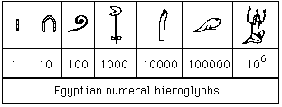
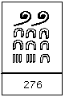
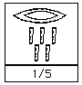

```{r setup, include=FALSE}
require(knitr)
require(kableExtra)
require(ggplot2)
require(reshape2)
library(tidyverse)
library(cowplot)
library(rlist)

#Knitr table options
options(knitr.table.format = "html") 

#Chunk options
opts_chunk$set(echo = FALSE)
opts_chunk$set(results = 'asis')
opts_chunk$set(fig.width  = 3)
opts_chunk$set(warning  = FALSE)
opts_chunk$set(message  = FALSE)
opts_chunk$set(fig.height = 2)
opts_chunk$set(fig.align='center')

#Knitr for rgl (3d)
#knit_hooks$set(webgl = hook_webgl)

#Function for authomatic theorem, corollary, example, counterexample, property, lemma and definition numbering
source("Rfun/theorem_creator.R")
source("Rfun/fractionplot.R")
```


# Operaciones con fracciones

Antes de hablar de las reglas de las operaciones con fracciones vale la pena analizar qué es lo que se hace cuando se tienen fracciones. La idea de una fracción es que éstas representan un todo que se dividió en partes (el denominador de la fracción) y del cual se tienen tantas partes como el numerador. Es decir, si se tiene:
$$
\dfrac{4}{5}
$$
se supone que un objeto unidad fue dividido en $5$ partes y por ahora se tienen $4$ de ellas. Esto es representado con el siguiente dibujo:

```{r, fig.cap="De un objeto dividido en $5$ partes se tienen $4$"}

fraction.plot(4,5)
```


Los nombres de cada una de las partes, como recordarás, son:
$$
\dfrac{\text{Numerador}}{\text{Denominador}}
$$
y buscan representar una divisiòn. Por ejemplo, si se tiene:
$$
\dfrac{21}{7}
$$
esto se interpreta como $21 \div 7 = 3$. Lo podemos ver también en el dibujo:

```{r, fig.cap="De un objeto dividido en $7$ partes se tienen $3$: en total hay $21$ de estos séptimos.", fig.width=9}

fraction.plot(21,7)
```


> Una fracción $\frac{12}{6}$ es lo mismo que una división $12\div 6$. El signo de $\div$ llamado óbelo fue introducido en Inglaterra por una traducción en 1659 de un libro suizo. A la Europa Continental le confundía el signo (muchos lo usaban como resta, rangos u otra cosa) pero, eventualmente, conforme creció el dominio inglés el óbelo se fue extendiendo a todo el mundo. Actualmente se recomienda usar fracciones para representar división (es decir $\frac{12}{6}$ se prefiere a $12\div 6$) porque hay varios países donde el óbelo $\div$ todavía significa otra cosa (@cajori1993history). De hecho, hay una norma [ISO](https://www.iso.org/standard/31898.html) (hay normas ISO para todo) que indica que es mejor usar fracciones al signo $\div$ ¡qué rareza!

Comencemos, entonces a hacer operaciones con fracciones. 

## Equivalencia de fracciones

El concepto de equivalencia de fracciones es primordial para entender qué es lo que ocurre con ellas. ¡No te distraigas! La forma más fácil de ver esto es con un ejemplo. Imagina que dividimos un objeto en $6$ partes de las cuales tenemos $4$: 

```{r, fig.cap="De un objeto dividido en $6$ partes tenemos $4$.", fig.width=3}
fraction.plot(4,6, fill = "orange")
```

Observa que el _total_ de las partes es lo mismo que si hubiéramos dividido en $3$ el objeto y tuviéramos $2$ partes:

```{r, fig.cap="De un objeto dividido en $6$ partes tenemos $4$.", fig.width=3}
fraction.plot(2,3, fill = "orange")
```

Para que lo veas mejor, los pongo lado a lado:

```{r, fig.cap="$\\frac{4}{6}\\equiv\\frac{2}{3}$.", fig.width=9}

frac.operation(c(4,6),"es equivalente a",c(2,3), 
               color = c("orange","orange"))
```

En este caso decimos que $\frac{4}{6}$ es equivalente a $\frac{2}{3}$ y si fuéramos muy quisquillosos lo escribiríamos con el signo $\equiv$ de equivalencia:

$$
\frac{4}{6}\equiv\frac{2}{3}
$$

Como no somos tan quisquillosos, lo escribiremos con un igual:
$$
\frac{4}{6}=\frac{2}{3}
$$

Armados con esta idea de que dos fracciones son equivalentes si representan lo mismo, veamos otros ejemplos:

**Ejemplo 1:** 

$$
\frac{3}{2} = \frac{18}{12}
$$

Como podemos ver en el dibujo:

```{r, fig.cap="$\\frac{3}{2} = \\frac{18}{12}$.", fig.width=12}

frac.operation(c(3,2),"=",c(18,12), 
               color = c("orange","orange"))
```

Observa que la forma de pasar del $\frac{3}{2}$ al $\frac{18}{12}$ es multiplicando tanto numerador como denominador por $6$:

$$
\frac{3}{2} =  \frac{3 \times 6}{2 \times 6} = \frac{18}{12}
$$

Esto nos lleva a la siguiente conclusión:

```{r}
ex <- "
Dos fracciones son equivalentes si al multiplicar (o dividir) el numerador y denominador <i>por el mismo número</i> obtienes la otra fracción. 
"

build_theorem("Propiedades",ex, proof = "", name = "Fracciones equivalentes" )
```

**Ejemplo 2:** 

$$
\frac{4}{2} = 2
$$

```{r, fig.cap="$\\frac{4}{2} = 2$.", fig.width=12}

frac.operation(c(4,2),"=",c(2,1), 
               color = c("orange","orange"))
```

En este caso, si quisieras argumentar que las fracciones son equivalentes, de acuerdo a la propiedad anterior, quizá me dirías "hey, Rodrigo, qué te pasa si aquí, en el $2$, no tengo denominador, ¿cómo puedo saber que son equivalentes?" Resulta que sí tienes denominador, y ese $2$ es en realidad un $\frac{2}{1}$ lo que pasa es que usualmente no escribimos el $1$ (pero piénsalo, tiene sentido decir que se tienen $2$ de $1$ pieza que no fue dividida). Y ésta es la esencia del ejemplo 3:

**Ejemplo 3:** 

$$
\frac{3}{1} = 3
$$

```{r, fig.cap="$\\frac{3}{1} = 3$.", fig.width=9}
fraction.plot(3,1, fill = "orange")
```

Podemos entonces hallar varias fracciones equivalentes al $3$ por ejemplo:

$$
3 = \frac{3}{1} = \frac{15}{5} = \frac{300}{100} = \frac{18}{6}
$$

Usualmente el acuerdo con las fracciones (acuerdo que mantendremos a lo largo de estas notas) es intentar _simplificarlas_ hasta el punto en el que no haya divisores en común entre el numerador y el denominador. De esta manera simplificamos, por ejemplo, 
$$
\frac{28}{16} = \frac{7 \times 4}{4 \times 4} = \frac{7}{4}
$$
Pues dentro de los factores que componen tanto al $28$ como al $16$ está el $4$. La fracción $\frac{7}{4}$ ya no se puede simplificar más porque no existe ningún número entero positivo que al ser multiplicado por algo dé $7$ y por otra cosa dé $4$. 


```{r}
ex <- "
Simplificar 
\\begin{equation}\\nonumber
\\dfrac{180}{99}
\\end{equation}
"

sol <- "
\\begin{equation}\\nonumber
\\begin{aligned}
\\dfrac{180}{99} = \\dfrac{60 \\times 3}{33 \\times 3}  = \\dfrac{60}{33}  = \\dfrac{20 \\times 3}{11 \\times 3}
 = \\dfrac{20}{11} 
\\end{aligned}
\\end{equation}
"

build_theorem("Ejercicio",ex, proof = sol, name = "Simplificación de fracciones" )
```

```{r}
ex <- "
Simplificar 
\\begin{equation}\\nonumber
\\dfrac{5040}{720}
\\end{equation}
"

sol <- "
\\begin{equation}\\nonumber
\\begin{aligned}
\\dfrac{5040}{720} = \\dfrac{504 \\times 10}{72 \\times 10}  = \\dfrac{504}{72}  = \\dfrac{63 \\times 8}{9 \\times 8}
 = \\dfrac{63}{9} = \\dfrac{7 \\times 9}{1 \\times 9} 
 = \\dfrac{7}{1} 
 = 7
\\end{aligned}
\\end{equation}
"

build_theorem("Ejercicio",ex, proof = sol, name = "Simplificación de fracciones" )
```

> En cualquier círculo que se tome, si se divide la medida de la circunferencia entre el díametro se obtiene una constante. Esto, sin importar el círculo. ¡Inténtalo con un vaso, un platillo volador o tu objeto redondo preferido! Desde hace muchos años se ha intentado aproximar de distintas formas dicha constante, de hecho [Zu Chongzhi](https://en.wikipedia.org/wiki/Zu_Chongzhi) en el siglo V encontró que en todos los círculos
$$
\dfrac{\text{Circunferencia}}{\text{Diámetro}} \approx \dfrac{355}{113}
$$
Su aproximación de $\frac{355}{113}$ se aleja menos de `r format(1/3748629, digits = 10, scientific = F)` del verdadero valor de ese radio, el escurridizo número $\pi$ ¡es increíble!

### Ejercicios

Los ejercicios son **SIN CALCULADORA**, esto para que cuando lleguemos a ejercicios más complejos (con letras en álgebra) puedas tener la práctica de ejercicios numéricos y te sea más fácil hacerlo. 

1.  <i class="em em-pencil2"></i> Simplifica las siguientes fracciones a su mínima expresión (_i.e._ cuando numerador y denominador ya no comparten divisores):

    a. $\frac{144}{48}$
    
    b. $\frac{800}{45}$
    
    c. $\frac{1680}{280}$
    
    d. $\frac{169}{13}$
    
    e. $\frac{17}{11}$

2. <i class="em em-pencil2"></i> Determina cuáles de las siguientes fracciones son equivalentes entre sí.
  
    a. $\frac{32}{84}$
    
    b. $\frac{105}{35}$
    
    c. $\frac{9}{3}$
    
    d. $\frac{8}{21}$
    
    e. $\frac{240}{630}$
    
    f. $\frac{432}{1024}$

3. Hallar el numerador ó denominador (representado por $\text{?}$) que permite la igualdad:

    a. $\frac{\text{?}}{15} = \frac{2}{5}$
    
    b. $\frac{63}{\text{?}} = 7$
    
    c. $\frac{\text{?}}{144} = \frac{5}{12}$
    
    d. $\frac{\text{?}}{8} = 20$
    
    e. $\frac{\text{?}}{8} = \frac{5}{4}$


4. <i class="em em-thinking_face"></i> Justifica explicando claramente la siguiente propiedad:

```{r}
ex <- "
Si una fracción $A$ es equivalente a una fracción $B$ y dicha fracción $B$ es equivalente a una tercera fracción $C$ entonces $A$ y $C$ son equivalentes. Escrito con álgebra esto es:
\\begin{equation}\\nonumber
\\dfrac{a}{b} \\equiv \\dfrac{c}{d} \\quad \\text{y} \\quad
\\dfrac{c}{d}  \\equiv \\dfrac{e}{f}
\\end{equation}
entonces:
\\begin{equation}\\nonumber
\\dfrac{a}{b} \\equiv  \\dfrac{e}{f}
\\end{equation}
"

sol <- "
\\begin{equation}\\nonumber
\\begin{aligned}
\\dfrac{5040}{720} = \\dfrac{504 \\times 10}{72 \\times 10}  = \\dfrac{504}{72}  = \\dfrac{63 \\times 8}{9 \\times 8}
 = \\dfrac{63}{9} = \\dfrac{7 \\times 9}{1 \\times 9} 
 = \\dfrac{7}{1} 
 = 7
\\end{aligned}
\\end{equation}
"

build_theorem("Propiedades",ex, proof = "", name = "Transitividad" )
```

5. <i class="em em-thinking_face"></i> Un truco usual para determinar si dos fracciones $\frac{a}{b}$ y $\frac{c}{d}$ son equivalentes entre sí es calcular $ad$ y $bc$. Si $ad = bc$ entonces las fracciones son equivalentes. Justifica, claramente por qué el truco funciona. 

## Suma y resta

Comencemos con el ejemplo más tranquilo: cuando el denominador es el mismo. Pensemos que tenemos $\frac{3}{5}$ y $\frac{1}{5}$. Esto nos da un total de $\frac{4}{5}$. Gráficamente esto se ve así:

```{r, fig.cap="Los $\\frac{3}{5}$ unidos con el otro $\\frac{1}{5}$ nos dan un total de $\\frac{4}{5}$.", fig.width=12}
frac.operation(c(3,5),"+",c(1,5),"=",c(4,5))
```

Lo mismo ocurriría en el caso de la resta: 
$$
\dfrac{7}{6} - \dfrac{2}{6} = \dfrac{5}{6}
$$
pues de los siete sextos que se tienen inicialmente se retiran dos. Gráficamente, esto se vería así:

```{r, fig.cap="Si a los $\\frac{7}{6}$ les quitamos $\\frac{2}{6}$ nos dan un total de $\\frac{5}{6}$.", fig.width=12}
frac.operation(c(7,6),"-",c(2,6),"=",c(5,6))
```

Las cosas pueden complicarse en cuanto el denominador no es el mismo, por ejemplo:
$$
\dfrac{2}{3} + \dfrac{1}{2}
$$

Aquí la suma no puede hacerse directo:
$$
\text{MAL} \quad \dfrac{2}{3} + \dfrac{1}{2} = \dfrac{2 + 1}{3} = \dfrac{3}{3} 
$$
Podemos ver gráficamente que la igualdad no se cumple:

```{r, fig.cap="Cosas que no hay que hacer: Sumar sólo denominadores", fig.width=12}
frac.operation(c(2,3),"+",c(1,2),"≠",c(3,1))
```

Tampoco tiene sentido sumar numerador y denominador por aparte, como lo desearía nuestro corazón:

$$
\text{MAL} \quad \dfrac{2}{3} + \dfrac{1}{2} = \dfrac{2 + 1}{3 + 2} = \dfrac{3}{5} 
$$

Pues gráficamente se ve que fallamos, aunque por menos:

```{r, fig.cap="Cosas que no hay que hacer: Sumar numeradores con numeradores y denominadores con denominadores", fig.width=12}
frac.operation(c(2,3),"+",c(1,2),"≠",c(3,5))
```

_¿Qué podemos hacer entonces?_ La idea es simple: utilizar fracciones equivalentes para hacer que ambas fracciones tengan el mismo denominador y una vez que se logra eso sumamos como lo estábamos haciendo antes. Una opción de fracciones equivalentes es si, por ejemplo, ponemos en el denominador un $18$ pues éste tiene en común el $2$ y el $3$. Podemos entonces transformar nuestras fracciones (ambas) a $18$avos:

$$
\dfrac{2}{3} = \dfrac{2\times 6}{3 \times 6} = \dfrac{12}{18} \quad \text{y} \quad \dfrac{1}{2} = \dfrac{1\times 9}{2 \times 9} = \dfrac{9}{18}
$$

Gráficamente podemos ver las equivalencias en $18$ avos:

```{r, fig.cap="Equivalencias a 18vos", fig.width=9, fig.height = 6}
plot_grid(frac.operation(c(2,3),"=",c(12,18)),
          frac.operation(c(1,2),"=",c(9,18)), ncol = 1)
```

Por lo que sumar los $18$avos es lo mismo que sumar los originales (son equivalentes). Sumamos entonces:

$$
\dfrac{2}{3} + \dfrac{1}{2} = \dfrac{12}{18} + \dfrac{9}{18} = \dfrac{21}{18} = \dfrac{7}{6}
$$
Podemos ver este ejercicio gráficamente:

```{r, fig.cap="Equivalencias a 18vos", fig.width=12, fig.height = 4}
plot_grid(frac.operation(c(2,3),"+",c(1,2)),
          ggplot() + 
            annotate("text",label="=",x=0,y=0, size = 10) +
            theme_void(),
          frac.operation(c(12,18),"+",c(9,18),"=",c(7,6)), 
          nrow = 1,
          rel_widths = c(3,1,5))
```

Por supuesto que no hay nada especial en los $18$avos y pudimos haber elegido otro número, por ejemplo con sextos:

$$
\dfrac{2}{3} + \dfrac{1}{2} = \dfrac{2\times 2}{3\times 2} + \dfrac{1\times 3}{2\times 3} = \dfrac{4}{6} + \dfrac{3}{6} = \dfrac{7}{6}
$$

O bien con $36$avos:

$$
\dfrac{2}{3} + \dfrac{1}{2} = \dfrac{2\times 12}{3\times 12} + \dfrac{1\times 18}{2\times 18} = \dfrac{24}{36} + \dfrac{18}{36} = \dfrac{42}{36} = \dfrac{7 \times 6}{6 \times 6} = \dfrac{7}{6}
$$

```{r, fig.cap="Equivalencias a 36vos", fig.width=12, fig.height = 4}
plot_grid(frac.operation(c(2,3),"+",c(1,2)),
          ggplot() + 
            annotate("text",label="=",x=0,y=0, size = 10) +
            theme_void(),
          frac.operation(c(24,36),"+",c(18,36),"=",c(7,6)), 
          nrow = 1,
          rel_widths = c(3,1,5))
```

Es decir, sin importar cuál número se elija, siempre se llega al mismo resultado.  Usualmente lo que se hace para elegir el denominador para la suma es multiplicar los denominadores que se tienen. Por ejemplo, para sumar:

$$
\dfrac{2}{5} + \dfrac{8}{7}
$$
en lugar de buscarse un número que pueda factorizarse tanto con $5$ como con $7$ entre todos los números que se te ocurran, lo más sencillo es crear el más fácil: el producto de ambos. Es decir, se escribe todo en $35$avos pues $5\times 7 = 35$:

$$
\dfrac{2}{5} + \dfrac{8}{7} = \dfrac{2\times 7}{5 \times 7} + \dfrac{8 \times 5}{7\times 5} = \dfrac{14}{35} + \dfrac{40}{35} = \frac{54}{35}
$$

Gráficamente:

```{r, fig.cap="Equivalencias a 35vos", fig.width=12, fig.height = 4}
plot_grid(frac.operation(c(2,5),"+",c(8,7)),
          ggplot() + 
            annotate("text",label="=",x=0,y=0, size = 10) +
            theme_void(),
          frac.operation(c(14,35),"+",c(40,35),"=",c(54,35)), 
          nrow = 1,
          rel_widths = c(3,1,5))
```

> Los egipcios utilizaban los siguientes jeroglíficos como números:
<br><center> 

</center> <br>
Escribiendo múltiples de estos símbolos podían hacer cualquier número. Por ejemplo, el $276$ se veía así, como una combinación de herraduras:
<br><center></center> <br>
Si ellos querían escribir una fracción, le ponían un ojo encima para indicar que, en lugar de $5$ tenían $\frac{1}{5}$:
<br><center></center> <br>
Sin embargo, ellos no podían escribir fracciones más complejas (como $\frac{2}{5}$) porque les estaba prohibido hacer copy-paste de sus símbolos para juntar el $\frac{1}{5}$ con otro $\frac{1}{5}$ en un $\frac{2}{5}$. Imagina las discusiones para dividir el terreno de la abuelita entre los $5$ tíos en las cenas familiares. ¡Seguramente eran más complicadas!

```{r}
ex <- "
Sumar 
\\begin{equation}\\nonumber
\\dfrac{3}{4} + \\dfrac{1}{5} + \\dfrac{7}{8}
\\end{equation}
"

sol <- "
Lo resolvemos por partes siguiendo el orden de las operaciones primero sumamos $\\dfrac{3}{4} + \\dfrac{1}{5}$ y luego al resultado le sumamos $\\dfrac{7}{8}$:

\\begin{equation}\\nonumber
\\begin{aligned}
\\dfrac{3}{4} + \\dfrac{1}{5} = \\dfrac{15}{20} + \\dfrac{4}{20} = \\dfrac{19}{20},
\\end{aligned}
\\end{equation}
luego:
\\begin{equation}\\nonumber
\\begin{aligned}
\\underbrace{\\dfrac{3}{4} + \\dfrac{1}{5}}_{19/20} + \\dfrac{7}{8}  = \\dfrac{19}{20} + \\dfrac{7}{8} = \\dfrac{152}{160} + \\dfrac{140}{160} = \\dfrac{292}{160} = \\dfrac{73}{40}.
\\end{aligned}
\\end{equation}
"

build_theorem("Ejemplo",ex, proof = sol, name = "Simplificación de fracciones" )
```

### Ejercicios 

1.  <i class="em em-pencil2"></i> Evalúa las siguientes expresiones dando el resultado de las operaciones en su mínima expresión (lo más simplificado posible):

    a. $\frac{6}{8} + \frac{14}{8}$
    
    b. $\frac{1}{5} + \frac{1}{4}$
    
    c. $4 + \frac{1}{4}$ 
    
    d. $\frac{6}{7} + \frac{1}{4}$ 
    
    e. $\frac{5}{2} + \frac{8}{3} + 10$ 
    
    f. $\frac{5}{2} + \frac{5}{4}$ 

2. Determina si los siguientes ejercicios fueron resueltos de manera correcta o no. En caso de que no, corrígelos señalando el error. 

```{r}
ex <- "
Sumar 
\\begin{equation}\\nonumber
\\dfrac{2}{4} + \\dfrac{5}{4} 
\\end{equation}
"

sol <- "
\\begin{equation}\\nonumber
\\begin{aligned}
\\dfrac{2}{4} + \\dfrac{5}{4}  = \\dfrac{7}{8}
\\end{aligned}
\\end{equation}
"

build_theorem("Ejercicio",ex, proof = sol, name = "Un ejercicio resuelto ¿bien?" )
```

```{r}
ex <- "
Sumar 
\\begin{equation}\\nonumber
\\dfrac{1}{3} + 2 
\\end{equation}
"

sol <- "
\\begin{equation}\\nonumber
\\begin{aligned}
\\dfrac{1}{3} + \\dfrac{2}{3}  = \\dfrac{3}{3} = 1
\\end{aligned}
\\end{equation}
"

build_theorem("Ejercicio",ex, proof = sol, name = "Un ejercicio resuelto ¿bien?" )
```

```{r}
ex <- "
Sumar 
\\begin{equation}\\nonumber
\\dfrac{1}{3} + \\dfrac{1}{5} 
\\end{equation}
"

sol <- "
\\begin{equation}\\nonumber
\\begin{aligned}
\\dfrac{1}{3} + \\dfrac{1}{5}  = \\dfrac{2}{8} = \\dfrac{1}{4}
\\end{aligned}
\\end{equation}
"

build_theorem("Ejercicio",ex, proof = sol, name = "Un ejercicio resuelto ¿bien?" )
```

```{r}
ex <- "
Sumar 
\\begin{equation}\\nonumber
\\dfrac{8}{9} + \\dfrac{4}{3} 
\\end{equation}
"

sol <- "
\\begin{equation}\\nonumber
\\begin{aligned}
\\dfrac{8}{9} + \\dfrac{4}{3}  = \\dfrac{8}{9} + \\dfrac{12}{9} = \\dfrac{20}{9}
\\end{aligned}
\\end{equation}
"

build_theorem("Ejercicio",ex, proof = sol, name = "Un ejercicio resuelto ¿bien?" )
```

3. <i class="em em-thinking_face"></i> Utilizando todo el desarrollo teórico que tuvimos para sumas explica claramente con dibujos y ejemplos cómo realizar restas de fracciones. En particular, utiliza los siguientes resultados como ejemplos:

    a. $\frac{4}{3} - \frac{2}{3} = \frac{2}{3}$ 
    
    b. $2 - \frac{1}{7} = \frac{13}{7}$
    
    c. $\frac{3}{4} - \frac{1}{7} = \frac{17}{28}$
    
4. <i class="em em-pencil2"></i> Realiza las siguientes operaciones de fracciones:

    a. $\frac{1}{5} - \frac{2}{6} + \frac{1}{3}$
    
    b. $\frac{7}{10} + (1 - \frac{1}{3})$
    
    c. $(\frac{79}{10} - 5) - (\frac{7}{8} + \frac{5}{9})$
    

5. <i class="em em-thinking_face"></i> Recordando que multiplicar por un número entero significa sumarlo tantas veces como el número, (por ejemplo: $7 \times 4 = \underbrace{4 + 4 + 4 + 4 + 4 + 4 + 4}_{7 \text{ veces}} = 28$ ), resuelve los siguientes productos que involucran fracciones:

    a. $7 \times \frac{1}{4}$
    
    b. $3 \times \frac{2}{5}$
    
    c. $8 \times \frac{10}{8}$
 
### Fórmula para sumar fracciones
En esta sección utilizaremos todo lo que sabemos para generar una fórmula para la suma de fracciones. Para ello vamos a pensar que tenemos dos fracciones: $\frac{a}{b}$ y $\frac{c}{d}$.

Recordamos que los pasos que hicimos fueron:

1. Poner todo en términos del mismo denominador. Una forma que siempre funciona es multiplicando los denominadores en este caso las transformamos:

\begin{equation}\label{sumafrac1}
\begin{aligned}
\frac{a}{b} & = \frac{a \cdot d}{b \cdot d} & = \frac{ad}{bd} \\ \\
\frac{c}{d} & = \frac{c \cdot b}{d \cdot b} & = \frac{bc}{bd} \\
\end{aligned}
\end{equation}

Por ejemplo, en el caso de 
$$
\dfrac{3}{4} + \dfrac{1}{5}
$$
tenemos que $a = 3$, $b = 4$, $c = 1$ y $d = 5$. Transformamos las fracciones a tener denominador común:
\begin{equation}\nonumber
\begin{aligned}
\frac{3}{4} & = \frac{3 \cdot 5}{4 \cdot 5} & = \frac{15}{20} \\ \\
\frac{1}{5} & = \frac{1 \cdot 4}{5 \cdot 4} & = \frac{4}{20} \\
\end{aligned}
\end{equation}
Visto de manera gráfica:
```{r, fig.cap="Equivalencias a 20vos", fig.width=12, fig.height = 6}
plot_grid(frac.operation(c(3,4),"+",c(1,5)),
          ggplot() + annotate("text", label = "=", x = 0, y = 0, size = 10) +
            theme_void(),
          frac.operation(c(15,20),"+",c(4,20)), nrow = 1,
          rel_widths = c(3,1,3))
```

2. Una vez que ambas fracciones cuentan con el mismo denominador \eqref{sumafrac1} sumamos los numeradores:
\begin{equation}\nonumber
\begin{aligned}
\frac{a}{b} + \frac{c}{d} & = \frac{ad}{bd} + \frac{cd}{bd} & = \frac{ad + cd}{bd}
\end{aligned}
\end{equation}

De donde se sigue que la fórmula para sumar dos fracciones $\frac{a}{b}$ y $\frac{c}{d}$ es:
\begin{equation}\label{suma}
\begin{aligned}
\frac{a}{b} + \frac{c}{d} & = \frac{ad + cd}{bd}
\end{aligned}
\end{equation}

En el ejemplo numérico que teníamos:

$$
\dfrac{3}{4} + \dfrac{1}{5} = \frac{15}{20} + \frac{4}{20} = \frac{15 + 4}{20}  
$$
lo cual está dado justamente por la fórmula:
$$
\frac{15 + 4}{20} = \frac{5 \cdot 3 + 4 \cdot 1}{4 \cdot 5} = \frac{ad + cd}{bd}.
$$

Que en imagen se ve como sigue:
```{r, fig.cap="Equivalencias a 20vos", fig.width=9, fig.height = 6}
frac.operation(c(15,20),"+",c(4,20),"=",c(19,20))
```


## Multiplicación de fracciones
Para explicar el producto de fracciones analizaremos dos casos por separado: la multiplicación de una fracción por un entero y la multiplicación de una fracción por otra donde una de ellas tiene numerador uno. Finalmente combinaremos la información para tratar fracciones arbitrarias y poder explicar cómo funciona todo el proceso.

> Para los matemáticos hay dos conjuntos importantes de números: los racionales, $\mathbb{Q}$ y los irracionales $\mathbb{I}$. Los primeros se caracterizan por poderse representar como una fracción; así $4$ es racional por ser $\frac{4}{1}$, $-3$ es racional ($\frac{-3}{1}$) y $\frac{289}{27}$ es racional. Empero, la mayor parte de los números son irracionales como $\pi$, $\sqrt{2}$ ó $e$. Y los irracionales son bastante curiosos. Hay varios que pueden aproximarse tanto como se desee, así se sabe que $\pi\approx 3.141592653589793115$ que $\sqrt{2}\approx 1.414213562373095145$ o que $e\approx 2.71828182845904509079$. Sin embargo [la mayor parte de los números irracionales son incomputables](https://medium.com/cantors-paradise/uncomputable-numbers-ee528830d295), esto quiere decir que, en su mayoría, ni siquiera existe un algoritmo que permita aproximarlos con la precisión deseada. En términos humanos: se ha demostrado que la mayor parte de los números que existen ni siquiera podemos escribirlos. ¡Vaya suerte!

### Multiplicación por un número entero
Pensemos en la siguiente multiplicación:

$$
5 \times \frac{1}{3}
$$

Si recordamos la interpretación con la que se enseña la multiplicación esto significa tener $5$ pedazos de tamaño $\frac{1}{3}$, como en la imagen:

```{r, fig.cap="Muchos tercios.", fig.width=12}
plot_grid(fraction.plot(1,3, fill = "purple"),
          fraction.plot(1,3, fill = "purple"),
          fraction.plot(1,3, fill = "purple"),
          fraction.plot(1,3, fill = "purple"),
          fraction.plot(1,3, fill = "purple"))
```

En símbolos esto puede escribirse como:
$$
5 \times \frac{1}{3} = \frac{1}{3} + \frac{1}{3} + \frac{1}{3} + \frac{1}{3} + \frac{1}{3} = \frac{5}{3}
$$

Que en diagrama equivale a:

```{r, fig.cap="$\\frac{5}{3}$", fig.width=3, fig.height = 2}
fraction.plot(5,3, fill = "purple")
```

Ésta es una forma de verlo, desde _la perspectiva del $5$_. Veámoslo ahora desde _la perspectiva del $1/3$_. Desde ésta perspectiva, consideremos que tenemos $5$ objetos:

```{r, fig.cap="$\\frac{15}{3}$", fig.width=9, fig.height = 2}
fraction.plot(15,3, fill = "purple")
```

Al momento de hacer el producto
$$
5 \times \frac{1}{3}
$$
lo que estamos haciendo en realidad es tomar una tercera parte de esos $5$ objetos: 

```{r, fig.cap="$\\frac{5}{3}$ y otras cosas", fig.width=9, fig.height = 2}
plot_grid(
  fraction.plot(5,3, fill = "purple"),
  fraction.plot(10,3, fill = "purple", alpha = 0), rel_widths = c(2, 4))
```

Es decir, lo que hace el producto por una fracción es tomar sólo una parte del todo. Por ejemplo al hacer:

$$
\frac{4}{7} \times 8
$$

Se dividen los $8$ objetos cada uno en séptimos:

```{r, fig.cap="Muchos séptimos. No los colorees a mano.", fig.width=9, fig.height = 2}
fraction.plot(56,7, fill = "purple", alpha = 0)
```

Y ahora, de cada uno de los séptimos se toman $4$:

```{r, fig.cap="Muchos séptimos. ¿Los cuentas?", fig.width=9, fig.height = 2}
plot_grid(
  fraction.plot(4,7, fill = "purple"),
  fraction.plot(4,7, fill = "purple"),
  fraction.plot(4,7, fill = "purple"),
  fraction.plot(4,7, fill = "purple"),
  fraction.plot(4,7, fill = "purple"),
  fraction.plot(4,7, fill = "purple"),
  fraction.plot(4,7, fill = "purple"),
  fraction.plot(4,7, fill = "purple"), nrow = 1
)
```

Si acabas sumando todos los séptimos, al final tienes $32$ de ellos:
$$
\frac{4}{7} + \frac{4}{7} + \frac{4}{7} + \frac{4}{7} + \frac{4}{7} + \frac{4}{7} + \frac{4}{7} + \frac{4}{7} = \frac{32}{7} 
$$

Observa que se llega al mismo resultado haciendo:
$$
\frac{4 \times 8}{7} = \frac{32}{7} 
$$

En resumen, la lógica del proceso consiste en dividir el entero (digamos el $8$) en tantas partes como el denominador ($7$) y luego tomar de esas partes tantas como lo requiera el numerador ($4$). Veamos ahora qué pasa cuando tenemos el producto de dos fracciones: 

```{r}
ex <- "
Algunos profesores de matemáticas les gusta utilizar fracciones mixtas del estilo:
\\begin{equation}\\nonumber
5 \\frac{1}{2}
\\end{equation}
que se leen como $5$ enteros y $\\frac{1}{2}$. Esta notación se refiere a tener $5$ enteros completitos y $\\frac{1}{2}$ extra (es decir, $\\frac{11}{2} = 5.5$ en total). En estas notas esa notación no se utilizará ya que se confunde fácilmente con el producto:
\\begin{equation}\\nonumber
5 \\cdot \\frac{1}{2} = \\frac{5}{2} = 2.5
\\end{equation}
Sin embargo, es importante que sepas pasar de fracciones mixtas a impropias (del $5 \\frac{1}{2}$ al $\\frac{11}{2}). ¿Se te ocurre cómo hacerle?
"


build_theorem("Nota",ex, proof = "", name = "Fracciones mixtas" )
```

### Multiplicación de dos fracciones entre sí

Considera el siguiente ejemplo:

$$
\frac{2}{3} \times \frac{1}{5}
$$

E intentemos seguir la lógica del proceso anterior. En este caso, cada uno de los tercios que tenemos los vamos a subdividir en $5$os y luego tomar dos de ellos (de la misma manera que anteriormente a nuestros $8$ rectángulos los dividíamos en séptimos y tomábamos cuatro de cada séptimo). Gráficamente: 

```{r, fig.cap="Rectángulos subdivididos en séptimos", fig.width=9, fig.height = 2}
plot_grid(
  plot.fraction(2,3, fill = "purple")[[1]],
  subfraction.plot(frac1 = c(2,3), frac2 = c(1,5), 
                  xlab = "1/5 de cada uno de esos 2/3")
)
```

Ese $1/5$ de los $2/3$ corresponde a haber dividido en $15$ el rectángulo y tomar $2$ de esos $15$avos. Es decir:

$$
\frac{2}{3} \times \frac{1}{5} = \frac{2}{15}
$$

Veamos otro ejemplo:

$$
\frac{3}{7} \times \frac{4}{11} 
$$

En este caso vamos a tomar un objeto que está dividido en séptimos de los cuales tenemos $3$; después a cada uno de esos séptimos los dividimos en $11$avos y de cada séptimo tomamos $4$ onceavos. Algo como en la figura:

```{r, fig.cap="Setenta y siete cuadrados", fig.width=9, fig.height = 2}
plot_grid(
  plot.fraction(3,7, fill = "purple", xlab = "Objeto dividido en séptimos. Tenemos tres de esos séptimos.")[[1]],
  subfraction.plot(frac1 = c(3,7), frac2 = c(4,11), 
                  xlab = "Cada séptimo se subdividió en 11 y tomas 4 subdivisiones")
)
```

Luego:

$$
\frac{3}{7} \times \frac{4}{11} = \frac{3 \cdot 4}{7 \cdot 11} = \frac{12}{77}
$$

El proceso de la multiplicación se puede entonces explicar de la siguiente manera:

$$
\text{Resolver} \quad \frac{9}{13} \times \frac{5}{7}
$$

1. Se tiene una fracción inicial, digamos $9/13$ que consiste en haber dividido un objeto en $13$ pedazos (tantos como el denominador) y contar con $9$ de ellos (los del numerador). 

```{r, fig.cap="$\\frac{9}{13}$", fig.width=3, fig.height = 2}
plot.fraction(9,13, fill = "purple", xlab = "9/13")[[1]]
```

2. Si se desea multiplicar por otra fracción, digamos $5/7$ entonces lo que se hace es que cada uno de esos $13$ pedazos se subdivide en séptimos (es decir, el total se subdivide en $13 \times 7 = 91$ cuadritos). De estos $91$ cuadritos se toman $9 \times 5 = 45$ pues para cada una de las $9$ rebanadas que sí se tenían se toman $5$ pedazos: 
```{r, fig.cap="Ahora son $\\frac{45}{91}$", fig.width=3, fig.height = 2}
subfraction.plot(frac1 = c(9,13), frac2 = c(5,7), 
                  xlab = "Tomas 45 de las 91 rebanadas")
```

Y ése es el resultado:
$$
\frac{9}{13} \times \frac{5}{7} = \frac{9\times 5}{13 \times 7}  = \frac{45}{91}
$$

3. Nota que gráficamente podemos ver que la multiplicación es conmutativa pues primero se pudo haber dividido en séptimos para más tarde tomar $9/13$ de cada séptimo:

```{r, fig.width=9, fig.height = 2}
plot_grid(
  plot.fraction(5,7, fill = "purple", xlab = "Objeto dividido en séptimos")[[1]],
  subfraction.plot(frac1 = c(5,7), frac2 = c(9,13), 
                  xlab = "Cada uno de los séptimos se subdividió en 13")
)
```


### Ejercicios

1. Multiplica las siguientes fracciones justificando con figuras los resultados:

    a. $\frac{3}{5} \times \frac{1}{2}$
    b. $3 \times \frac{3}{4}$
    c. $\frac{4}{3} \times \frac{1}{3}$
    d. $\frac{4}{3} \times \frac{5}{4}$

2. <i class="em em-pencil2"></i>  Multiplica las siguientes fracciones, no justifiques con figuras:

    a. $\frac{3}{5} \times \frac{9}{12}$
    b. $\frac{1}{2} \times \frac{4}{9}$
    c. $5 \times \frac{11}{12}$
    d. $10 \times \frac{3}{1}$
    e. $\frac{1}{3} \times \frac{2}{4} \times \frac{3}{5}$
    
3. Determina el/los números marcados con interrogación de tal manera que el producto te da la igualdad deseada. Puede haber múltiples respuestas correctas si hay más de un signo de interrogación en el enunciado. 

    a. $\frac{3}{5} \times \frac{\text{?}}{2} = \frac{21}{10}$
    
    b. $\frac{6}{7} \times \frac{\text{?}}{\text{?}} = 1$
    
    c. $\frac{3}{5} \times \frac{24}{\text{?}} = \frac{6}{5}$
    
    d. $\frac{9}{7} \times \frac{14}{\text{?}} = 1$
    
    e. $\frac{3}{2} \times \frac{\text{?}}{\text{?}} = \frac{8}{9}$
    
_Hint_ Si no se te ocurre cómo, dibuja los problemas. 

4. Las siguientes son fracciones mixtas. conviértelas a impropias:

    a. $5\frac{1}{3}$
    b. $7\frac{3}{7}$
    c. $12\frac{8}{10}$
    d. $1\frac{2}{5}$
    e. $2\frac{7}{9}$

### Fórmula
Podemos plantearnos cómo se ve el caso general. Si tenemos un producto entre dos fracciones:
$$
\frac{a}{b} \times \frac{c}{d} 
$$

Lo que tenemos es un objeto dividido en $b$ partes de las cuales tenemos $a$ de ellas:

```{r, fig.cap="$\\frac{a}{b}$", fig.width=3, fig.height = 2}
plot.simple.fraction(17,31, fill = "purple", xlab = "a/b")
```

Cada una de esas $b$ partes es luego subdividida en $d$ pedazos más pequeños de los cuales se toman $c$:

```{r, fig.cap="Tomas $c$ de estos $a$ pedazos divididos en $d$ trozos más", fig.width=3, fig.height = 2}
subfraction.plot(frac1 = c(17,31), frac2 = c(22,30), xlab = "")
```

Y por tanto se tienen $a \cdot c$ pedazos de tamaño $b \cdot d$:
\begin{equation}\label{mult}
\frac{a}{b} \times \frac{c}{d} = \frac{a c}{b  d}
\end{equation}


## División de fracciones

Como sabes, la división es la operación contraria a multiplicar. Si por ejemplo:
$$
4 \times 7 = 28
$$

Dividir 
$$
28 \div 7 = 4
$$
Es preguntarse por qué número hubo que multiplicar al $7$ para obtener el $4$. Escrito de otra forma, la pregunta principal es cuántos $7$s caben en $28$. La respuesta es $4$ pues:
$$
\underbrace{7 + 7 + 7 + 7}_{4 \text{ veces}} = 28
$$

Ésta lógica es la misma cuando hacemos la siguiente división:
$$
\frac{1}{2} \div \frac{1}{6}
$$
La pregunta es cuántos sextos caben en $\frac{1}{2}$. Es decir, de un objeto total de tamaño $1$ si se tienen sextos, con cuántos hacemos una mitad. Podemos ver gráficamente que la respuesta son $3$:


```{r, fig.cap="$\\frac{1}{2}\\div\\frac{1}{6} = 3$", fig.width=3, fig.height = 2}
subfraction.plot(frac1 = c(1,2), frac2 = c(3,3), 
                 fill1 = "firebrick",
                 fill2 = "firebrick",
                 xlab = "Caben 3 pedazos de 1/6 para hacer 1/2")
```

Luego 
$$
\frac{1}{2} \div \frac{1}{6} = 3
$$

Podemos hacernos la misma pregunta, con exactamente los mismos números pero al revés: ¿cuántos medios caben en un sexto? En matemáticas la pregunta es de esta forma:

$$
\frac{1}{6}  \div \frac{1}{2}
$$

Dado que en el dibujo pasado vimos que $\frac{1}{2}$ era mayor que $\frac{1}{6}$ entonces ni siquiera todo el medio va a caber dentro del sexto, debe ser sólo un pedazo de ese medio el que acabe dentro del sexto. 

```{r, fig.cap="$\\frac{1}{2}\\div\\frac{1}{6} = 3$", fig.width=3, fig.height = 2}
frac.operation(c(1,6),"vs",c(1,2), color = "firebrick")
```

Por el diagrama, podemos que el $1/2$ en realidad lo podemos ver como tres sextos:
```{r, fig.cap="$\\frac{1}{2}\\div\\frac{1}{6} = 3$", fig.width=3, fig.height = 2}
frac.operation(c(1,6),"vs",c(3,6), color = "firebrick")
```

De donde se seguiría que es $1/3$ del medio el que nos genera el sexto:
$$
\frac{1}{6} \div \frac{1}{2} = \frac{1}{3}
$$

Verificamos que estamos bien haciendo:
$$
\frac{1}{2} \cdot \frac{1}{3} = \frac{1}{6}
$$

> Para la construcción de relojes a partir de engranes (estoy pensando en el reloj de bolsillo de cuerda y no en un _smartwatch_) se requiere la conexión de varios engranes que surgen de uno sólo, el que está conectado a la cuerda:
<br><center>

</center><br>
Se sabe que un minuto es $\frac{1}{60}$ de una hora mientras que un segundo es $\frac{1}{60}$ de minuto (¿$\frac{1}{3600}$ de hora?). Para que el reloj funcione a la perfección se debe de dividir una hora entre el número de rotaciones que realiza el engrane principal (el conectado a la cuerda), luego fraccionar el giro de la hora en minutos y finalmente el del minutos en segundos. Los relojeros deben asegurarse de que cada engrane tenga un número entero de dientes. La precisión de un reloj depende de qué tan bien pudieron hacer esas divisiones y llenar de dientes los engranes. ¿Te imaginas tener que pulir $3600$ dientes? 

La pregunta que sigue es: en general, ¿cómo podemos hallar un método para encontrar ese $\frac{1}{3}$. Nota que lo que tuvimos que hacer, de nuevo, es poner ambos términos en la misma base, es decir, usar la equivalencia de fracciones para transformar $\frac{1}{2}\to\frac{3}{6}$.^[A partir de lo que hicimos con el producto recordarás que una forma que siempre funciona para poner las dos fracciones en términos de la misma base es multiplicar los denominadores.] Haremos eso:

\begin{equation}\nonumber
\begin{aligned}
\frac{1}{6} & = \frac{1 \cdot 2}{6 \cdot 2} & = \frac{2}{12} \\ \\
\frac{1}{2} & = \frac{1 \cdot 6}{2 \cdot 6} & = \frac{6}{12} 
\end{aligned}
\end{equation}

Gráficamente esto es lo que tenemos:

```{r, fig.cap="$\\frac{2}{12}\\div\\frac{6}{12}$", fig.width=3, fig.height = 2}
frac.operation(c(2,12),"÷",c(6,12), color = "firebrick")
```

Una vez que ambos están en la misma escala, basta con ver cuánto del $6$ cabe en el $2$; es decir: $2\div 6 = \frac{2}{6} = \frac{1}{3}$. De aquí se sigue que:

$$
\frac{1}{6}\div\frac{1}{2} = \frac{1}{3}
$$

En resumen, los pasos realizados fueron:

1. Poner ambas fracciones en términos de unas equivalentes para que compartan el denominador (la forma más fácil es multiplicando los denominadores).

```{r, fig.cap="$\\frac{2}{12}\\div\\frac{6}{12}$", fig.width=12, fig.height = 2}
plot_grid(
  plot.simple.fraction(5,14, xlab = "a/b", fill = "firebrick"),
  ggplot() + annotate("text", label = "÷", x = 0, y = 0, size = 10) + theme_void(),
  plot.simple.fraction(2,3, xlab = "c/d", fill = "firebrick"),
  ggplot() + annotate("text", label = "=", x = 0, y = 0, size = 10) + theme_void(),
  plot.simple.fraction(15,42, xlab = "ad/bd", fill = "firebrick"),
  ggplot() + annotate("text", label = "÷", x = 0, y = 0, size = 10) + theme_void(),
  plot.simple.fraction(28,42, xlab = "bc/bd", fill = "firebrick"), nrow = 1)
```

2. Dividir los numeradores. 

```{r, fig.cap="$\\frac{2}{12}\\div\\frac{6}{12}$", fig.width=3, fig.height = 2}
plot.simple.fraction(15,28, xlab = "ad/bc", fill = "firebrick")
```

Veamos otro ejemplo:
$$
\text{Resolver} \qquad \frac{4}{5} \div \frac{7}{3}
$$

Para ello primero ponemos ambas fracciones en términos del mismo denominador (en este caso denominador $15$):

\begin{equation}\nonumber
\begin{aligned}
\frac{4}{5} & = \frac{4 \cdot 3}{5 \cdot 3} & = \frac{12}{15} \\ \\
\frac{7}{3} & = \frac{7 \cdot 5}{3 \cdot 5} & = \frac{35}{15} 
\end{aligned}
\end{equation}

Gráficamente:

```{r, fig.cap="Equivalencia para $\\frac{4}{5}\\div\\frac{7}{3}$", fig.width=9, fig.height = 2}
frac.operation(c(12,15),"÷",c(35,15), color = "firebrick")
```

Una vez que están en la misma escala sólo falta ver cuántos de esos $35$ podemos meter en los $12$: $\frac{12}{35}$.

$$
\frac{4}{5} \div \frac{7}{3} = \frac{12}{35}
$$

### Ejercicios
1. Justifica con dibujos por qué la multiplicación de fracciones sí es conmutativa (da igual el orden en el que se haga), es decir: $\frac{7}{3} \times \frac{2}{11} = \frac{2}{11} \times \frac{7}{3}$ pero la división de fracciones no lo es en general:
$\frac{2}{11} \div \frac{7}{3} \neq \frac{7}{3} \div \frac{2}{11}$ (en general)

2. <i class="em em-pencil2"></i> Realiza las siguientes divisiones: 

    a. $\frac{3}{5} \div \frac{1}{2}$
    b. $3 \div \frac{3}{4}$
    c. $\frac{4}{3} \div \frac{1}{3}$
    d. $\frac{4}{3} \div \frac{5}{4}$
    e. $\frac{3}{5} \div \frac{9}{12}$
    f. $\frac{1}{2} \div \frac{4}{9}$
    g. $5 \div \frac{11}{12}$
    h. $10 \div \frac{3}{1}$
    i. $\frac{1}{3} \div \frac{2}{4} \div \frac{3}{5}$
    
3. Determina el/los números marcados con interrogación de tal manera que la división te da la igualdad deseada. Puede haber múltiples respuestas correctas si hay más de un signo de interrogación en el enunciado. 

    a. $\frac{3}{5} \div \frac{\text{?}}{2} = \frac{6}{35}$
    
    b. $\frac{6}{7} \div \frac{\text{?}}{\text{?}} = 1$
    
    c. $\frac{3}{5} \div \frac{24}{\text{?}} = \frac{6}{120}$
    
    d. $\frac{9}{7} \div \frac{14}{\text{?}} = 1$
    
    e. $\frac{3}{2} \div \frac{\text{?}}{\text{?}} = \frac{8}{9}$
    
4. Justifica por qué dividir entre un número $b$ es lo mismo que multiplicar por $\frac{1}{b}$; es decir, justifica por qué igualdades así ocurren:
    
    a. $14 \div 7 = 14 \times \frac{1}{7}$
    b. $15 \div 5 = 15 \times \frac{1}{5}$
    c. De manera general: $a \div b = a \times \frac{1}{b}$

5. Verifica que un segundo es $\frac{1}{3600}$ de hora. 

    a. ¿Qué fracción del día es? ¿Y de la semana?
    b. ¿A cuántos años de $365$ días corresponden $10000$ segundos?

### Fórmula 
Por último vamos a intentar encontrar una fórmula para las divisiones. Para ello consideremos dos fracciones distintas $\frac{a}{b}$ y $\frac{c}{d}$ como en los casos anteriores. Recordando los pasos: 

1. Primero ponemos ambas fracciones en los mismos denominadores (como ya hicimos en \eqref{sumafrac1})

\begin{equation}\nonumber
\begin{aligned}
\frac{a}{b} & = \frac{a \cdot d}{b \cdot d} & = \frac{ad}{bd} \\ \\
\frac{c}{d} & = \frac{c \cdot b}{d \cdot b} & = \frac{bc}{bd} \\
\end{aligned}
\end{equation}

2. En segundo lugar, realizamos la división de los numeradores:

\begin{equation}\label{division}
\begin{aligned}
\frac{a}{b}\div\frac{c}{d} = \frac{ad}{bd}
\end{aligned}
\end{equation}

De ahí obtenemos la fórmula para la división dada por \eqref{division}.

# Ejercicios de la sección 

Realiza las siguientes operaciones con fracciones. Puedes usar calculadora mientras no sea científica. 

1. Realiza las siguientes operaciones. Reduce el resultado a su mínima expresión (es decir simplifica la fracción hasta que numerador y denominador sean lo más pequeños que pueden ser):

    a. $\frac{1}{3}\cdot \Big( \frac{1}{2} - \frac{1}{7} \Big)$
    b. $\Big( \frac{7}{2} + \frac{3}{5} \Big)^2$
    c. $\frac{1}{3}\times\frac{1}{4}\times\frac{6}{5} + 2$
    d. $\Big(\frac{3}{7} - \frac{2}{3} + \frac{1}{21}\Big) \div 3$
    e. $\Big( \frac{8}{2} - 3 \Big) \cdot \Big( \frac{11}{13} + 1 \Big)$
    f. $\Big(\frac{1}{2} + \frac{2}{3} \times \frac{4}{5} - \frac{7}{6}\Big)\div \frac{9}{10}$

2. <i class="em em-thinking_f¸ace"></i> Justifica que el cuadrado de una fracción es la fracción que contiene los cuadrados; es decir:
$$
\Big(\frac{a}{b}\Big)^2 =\frac{a^2}{b^2} 
$$
_Hint_ Explica primero cómo funciona el caso $\Big( \frac{4}{5} \Big)^2 = \frac{16}{25}$ y recuerda que elevar al cuadrado es multiplicar un número por sí mismo. 

3. <i class="em em-thinking_face"></i> Utiliza el resultado anterior para argumentar que la raíz cuadrada de una fracción es la fracción que contiene las raíces.  
$$
\sqrt{\frac{a}{b}} =\frac{\sqrt{a}}{\sqrt{b}} 
$$
_Hint_ Explica primero cómo funciona el caso $\sqrt{\frac{16}{25}} = \frac{4}{5}$. 

4. <i class="em em-thinking_face"></i> Justifica con dibujos que si una fracción se le multiplica por un número idéntico al denominador, el denominador se elimina; es decir:
$$
b \times \frac{a}{b} = a
$$
_Hint_ Explica primero cómo funciona el caso $6 \times \frac{5}{6} = 5$. 

5. <i class="em em-thinking_face"></i> Justifica con dibujos que si una fracción se le multiplica por otra cuyo numerador es idéntico al denominador de la primera, el denominador se elimina; es decir:
$$
\frac{b}{c} \times \frac{a}{b} = \frac{a}{c}
$$
_Hint_ Explica primero cómo funciona el caso $\frac{6}{7} \times \frac{5}{6} = \frac{5}{7}$. 

6. <i class="em em-runner"></i> Utiliza los puntos anteriores para calcular rápidamente^[En menos de un minuto por fracción.]:

    a. $\frac{4334432}{5} \times 5$
    
    b. $3032846 \times \frac{77}{3032846}$
    
    c. $12384 \times \frac{1}{12384}$
    
    d. $144 \times \frac{834679}{144}$
    
    e. $\frac{913247342}{663264843} \times 663264843$
    
    f. $\frac{1999999999999999}{2000000000000} \times 2000000000000$
    

7. <i class="em em-runner"></i>  Determina de manera rápida el valor de las siguientes multiplicaciones usando los anteriores puntos^[En menos de un minuto por fracción]:

    a. $\frac{4}{8} \times \frac{8}{2}$
    
    b. $\frac{3}{12} \times \frac{5}{3}$
    
    c. $\frac{7}{3} \times \frac{1}{7}$
    
    d. $\frac{4}{3} \times \frac{5}{4}$
    
    e. $\frac{12}{1} \times \frac{8}{12}$
    
    f. $\frac{5}{2} \times \frac{2}{5}$
    
        
8. <i class="em em-thinking_face"></i>  Demuestra que una fórmula para la resta de fracciones $\frac{a}{b} - \frac{c}{d}$ es $\frac{ad - cd}{bd}$

9. <i class="em em-thinking_face"></i>  Demuestra las siguientes fórmulas:
  a. $\frac{a}{b} \div a = \frac{1}{b}$
  b. $\frac{a}{b} \div \frac{1}{b} = a$
  c. $\frac{a}{b} \div \frac{a}{b} = 1$

10. <i class="em em-runner"></i>  Determina de manera rápida el valor de las siguientes divisiones usando los anteriores puntos^[En menos de un minuto por fracción]:

  a. $\frac{347}{42535}\div 347$
  b. $\frac{347}{42535}\div 42535$
  c. $\frac{234834}{234564}\div \frac{234834}{234564}$
  d. $\frac{2}{234564}\div \frac{1}{234564}$
  e. $\frac{777777}{777777}\div 777777$
  f. $\frac{426534769}{42535}\div \frac{1}{426534769}$

11. <i class="em em-thinking_face"></i> Suponiendo que se tienen dos fracciones con términos positivos: $\frac{a}{b}$ y $\frac{c}{d}$. Deduce que 
$$
\frac{a}{b} > \frac{c}{d}
$$
Si $ad > bc$. _Hint_ Usar fracciones equivalentes para poner ambas fracciones con el mismo denominador.

12. Utiliza la regla que dedujiste en el punto anterior para ordenar de mayor a menor las siguientes fracciones:
$$
\frac{7}{9}, \frac{177}{208}, \frac{43}{97}, \frac{14}{19}
$$
  


# Ejercicio de aplicación

La prevalencia de VIH en la población mayor a $15$ años de México es $0.2\%$; es decir, de toda la población se estima que $\frac{2}{1000}$ personas en el rango de edad viven con VIH ($\frac{998}{1000}$ no lo padecen). La prueba rápida de VIH detecta al 99\‰ de las personas ($\frac{99}{100}$) con la enfermedad correctamente (verdaderos positivos). Sin embargo, de aquellas personas que la prueba clasifica como personas con VIH, el $2\%$ ($\frac{2}{100}$), en realidad son falsos positivos (personas que la prueba clasifica como si padecieran la enfermedad pero no la tienen).

  1. Suponiendo que una persona de México se hace la prueba por primera vez y resulta positiva. ¿Cuál es la probabilidad de que padezca la enfermedad?
    
  2. Suponiendo que esa misma persona vuelve a hacerse la prueba por segunda vez y de nuevo resulta positiva. ¿Cuál es la probabilidad de que padezca la enfermedad? Suponemos, además que las pruebas no se afectan la una a la otra (es decir, el aplicar la 1a prueba no afecta el resultado de la segunda)
    
  3. <i class="em em-thinking_face"></i> (Problema difícil para pensarle porque tiene solución pero es compleja)  Si la persona anterior resulta positiva en todas las pruebas que se realiza, ¿cuántas pruebas con resultado positivo debe realizarse para estar 99\% seguro de que padece VIH? Esto asumiendo que la probabilidad de ser falso positivo es independiente en todas las pruebas. 
    
  4. <i class="em em-thinking_face"></i> (Problema difícil para pensarle porque tiene solución pero es compleja) Suponiendo que la población cuenta con $100$ millones de habitantes mayores a $15$ años, y que cada enfermo de VIH que no fue detectado a tiempo cuesta al gobierno $200,000$ más, mientras que un falso positivo cuesta $200$ (por reaplicar la prueba). ¿Cuántas pruebas de VIH deben aplicarse para minimizar el gasto?^[Si se aplican _demasiadas_ pruebas acaba siendo muy caro y ese dinero se pudo utilizar en otros programas de salud.] 

# Referencias


